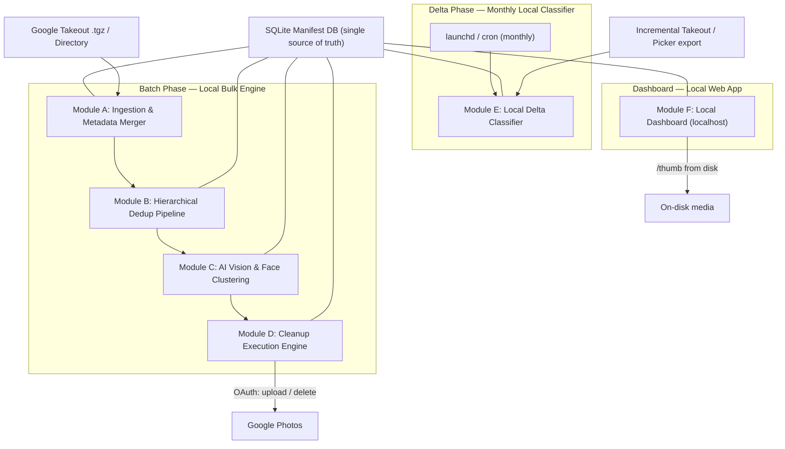
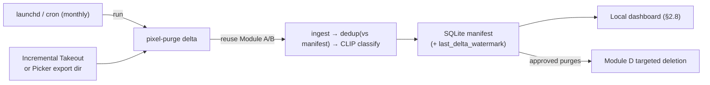
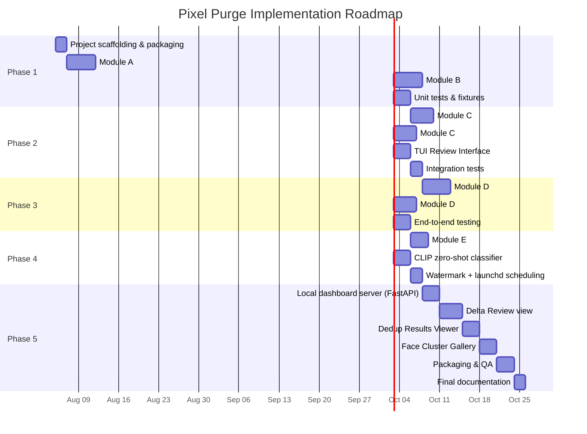

# Pixel Purge — Product Requirements Document

**Google Photos Cleanup, Classification, and Deduplication Agent System**

| Field | Value |
|---|---|
| **Version** | 1.1 |
| **Date** | 2026-08-04 |
| **Status** | Draft — Pending Approval |
| **Repository** | `pixel-purge` |
| **Target Platform** | macOS (Apple Silicon M1 Max, 32GB) primary; Linux/Windows secondary |

---

## 1. Executive Summary & Goals

### 1.1 Vision

Pixel Purge is a **fully local-first** photo management system that solves the fundamental problem of Google Photos library entropy: years of accumulated duplicates, screenshots, receipts, and junk media that consume storage and degrade the library's usefulness. All processing, storage, ML inference, and the dashboard run on the user's own machine — **no cloud hosting, no serverless components, no third-party data store**. The only network interaction is with Google Photos itself (for the re-upload / targeted-delete step), using the user's own OAuth credentials.

The system operates in two modes:

1. **Batch Phase (Local Bulk Engine):** A one-time deep clean of the entire library via Google Takeout export — deduplication, AI classification, face clustering, and curated cleanup.
2. **Delta Phase (Monthly Local Classifier):** A monthly, locally-run triage of newly added photos (via an incremental Takeout or Photos Picker export) using on-device AI to prevent entropy from re-accumulating. Scheduled with `launchd`/`cron` on the user's Mac.

### 1.2 Target User Persona

| Attribute | Detail |
|---|---|
| **Name** | "Vishnu" — Power User |
| **Library Size** | 50GB+, 20,000+ items |
| **Pain Point** | Google Photos provides no bulk cleanup, no duplicate detection, and no automated classification beyond basic search |
| **Technical Comfort** | Can run CLI tools, set up Google OAuth desktop credentials, run a local dev server |
| **Hardware** | Mac M1 Max, 32GB RAM |

### 1.3 Primary Success Metrics

| Metric | Target |
|---|---|
| Storage reclaimed | ≥30% of original library size |
| Duplicate detection recall | ≥95% (exact + near-duplicate) |
| Manual cleanup time reduction | ≥90% vs. manual Google Photos UI deletion |
| False positive deletion rate | <0.1% (no precious photos auto-deleted) |
| Monthly classification latency | <15 minutes for ~500 new photos (local, on-device) |
| Cloud infrastructure cost | $0.00/month — fully local, no hosted services provisioned |
| Pipeline resumability | 100% — no work lost on crash or interrupt |

---

## 2. System Architecture & Component Specifications

### 2.1 High-Level Architecture

Everything below runs on the user's Mac. The only external endpoint is Google Photos, reached over the user's own OAuth credentials for the cleanup (upload / targeted delete) step.



### 2.2 Technology Stack

| Component | Technology |
|---|---|
| Language | Python 3.11+ |
| CLI Framework | Typer (with `rich` integration) |
| Data Store | SQLite 3 (WAL mode) with CSV export |
| Binary Hashing | `hashlib` (SHA-256) |
| Perceptual Hashing | `imagehash` (pHash) |
| Vision Model | open_clip `ViT-B-32` (`laion2b_s34b_b79k`) zero-shot via PyTorch MPS |
| Face Detection/Embedding | InsightFace `buffalo_l` via ONNX Runtime (CoreML EP on M-series) |
| Face Clustering | `scikit-learn` DBSCAN |
| Video Keyframe | `ffmpeg-python` |
| Browser Automation | Playwright |
| Google Photos API | `google-api-python-client` + `google-auth-oauthlib` (upload / delete only) |
| Delta Classifier | Local CLIP zero-shot (`open_clip` / `transformers`) — unified taxonomy, on-device |
| Delta Scheduler | `launchd` (macOS) / `cron` — runs the local `pixel-purge delta` command |
| Dashboard Framework | SvelteKit (dev/static build) served locally |
| Dashboard Server | Local FastAPI + `uvicorn` (`localhost`), reads SQLite + streams thumbnails from disk |
| Secret Management | macOS Keychain (`keyring`) — OAuth token stored locally |
| Progress UI | `rich.progress` + `rich.table` |
| Packaging | `pyproject.toml` with entry points |
| Testing | `pytest` with synthetic fixtures |

---

### 2.3 Module A: Ingestion & Metadata Merger

#### Purpose
Parse Google Takeout exports (`.tgz` archives or extracted directories), discover all media files, merge stripped EXIF metadata from companion `.json` sidecar files back into the manifest, and extract video keyframes.

#### Input Formats
- **Archives:** One or more `takeout-*.tgz` files (auto-detected by extension)
- **Directory:** Pre-extracted Takeout directory tree
- **Auto-detection:** CLI inspects the input path and determines format automatically

#### Sidecar JSON Resolution Algorithm

Google Takeout uses inconsistent sidecar naming conventions. The merger must attempt resolution in this priority order:

```
Priority 1: {filename}.json                    (e.g., IMG_1234.jpg.json)
Priority 2: {filename}.supplemental-metadata.json  (also matched on {stem}, plus
            truncated variants: .supplemental-meta.json, .suppl.json)
Priority 3: {stem}-edited.json                 (an "-edited" media file also maps
            back to its base {base}.json)
Priority 4: IMG_1234(1).jpg -> IMG_1234.jpg(1).json / IMG_1234(1).jpg.json / base
```

Implemented in `ingestion/sidecar_merger.py::resolve_sidecar`. When no sidecar is
found the item falls back to embedded EXIF (below); a ±2s `photoTakenTime`
directory match is **not** implemented — the EXIF fallback covers that case in
practice.

#### Fields Extracted from Sidecar JSON

| JSON Field | Manifest Column | Type | Nullable |
|---|---|---|---|
| `photoTakenTime.timestamp` | `taken_timestamp` | INTEGER (Unix epoch) | YES |
| `geoData.latitude` | `latitude` | REAL | YES |
| `geoData.longitude` | `longitude` | REAL | YES |
| `geoDataExif.latitude` | `latitude` (fallback) | REAL | YES |
| `geoDataExif.longitude` | `longitude` (fallback) | REAL | YES |
| `description` | `user_description` | TEXT | YES |
| `title` | `original_title` | TEXT | YES |
| `imageViews` | `view_count` | INTEGER | YES |
| `creationTime.timestamp` | `creation_timestamp` | INTEGER (Unix epoch) | YES |

#### Video Keyframe Extraction

For video files (`.mp4`, `.mov`, `.avi`, `.mkv`, `.3gp`, `.webm`, `.m4v`), several
evenly-spaced keyframes are extracted for robust multi-frame dedup [M9]:

```python
# ingestion/keyframe.py::extract_keyframes — N frames at (i+1)/(N+1) of duration
# (e.g. 25% / 50% / 75% for N=3); duration comes from ffprobe.
for seek in [duration * (i + 1) / (n + 1) for i in range(n)]:
    ffmpeg -y -ss {seek} -i {video} -frames:v 1 -q:v 2 {stem}_kf{idx}.jpg
```

- The **middle frame** is recorded as `keyframe_path` and used for thumbnails,
  CLIP vision, and face detection.
- **All frames** are recorded as `keyframe_paths` (JSON) and the probed
  `duration_seconds` is stored; Tier 3 uses these for multi-frame video dedup.
- If `ffmpeg`/`ffprobe` is not installed, keyframe extraction is skipped
  gracefully — the video still participates in exact-hash dedup.

Still images in HEIC/RAW are decoded through `ingestion/decode.py` (`pillow-heif`
/ `rawpy` when the `[heic]`/`[raw]` extras are installed), which raises a clear
`UnsupportedImageError` (log-and-skip) rather than crashing when a decoder is
absent [M3].

#### CLI Interface

```bash
# Ingest from extracted directory
pixel-purge ingest ~/Downloads/Takeout/Google\ Photos/

# Ingest from .tgz archives
pixel-purge ingest ~/Downloads/takeout-*.tgz

# Resume interrupted ingestion
pixel-purge ingest ~/Downloads/Takeout/ --resume

# Dry run — report what would be ingested
pixel-purge ingest ~/Downloads/Takeout/ --dry-run
```

#### Checkpoint & Resumability

- Each successfully processed file is recorded in `media_items` with `ingestion_status = 'COMPLETE'`; failures are recorded with `ingestion_status = 'ERROR'` and an `error_message` so they aren't retried forever.
- On resume, the module skips files whose **full path** is already present (`db.get_ingested_paths()`) — keyed on `local_path` (the UNIQUE column), **not** the basename, because Takeout reuses filenames across albums [M1].
- Progress displayed via `rich.progress.Progress` showing files processed / total discovered.

#### Pseudo-code

```python
def ingest(source_path, db, resume=True, dry_run=False, extract_keyframes_enabled=True):
    """Module A: ingest + merge metadata from a Google Takeout export."""

    # 1. Resolve input (auto-detect .tgz vs directory; extract archives safely)
    media_root = resolve_media_root(Path(source_path))

    # 2. Discover media (extensions in ingestion/media.py — incl. heic/heif,
    #    raw/cr2/nef/arw/dng, webp/bmp/tiff, mp4/mov/mkv/3gp/webm/m4v, ...)
    all_files = discover_media_files(media_root)

    # 3. Resume by FULL PATH, not basename [M1]
    if resume:
        already = db.get_ingested_paths()          # set of local_path
        pending = [f for f in all_files if str(f) not in already]
    else:
        pending = all_files

    for media_file in pending:                     # (rich progress bar around this)
        try:
            record = MediaRecord(filename=media_file.name,
                                 local_path=str(media_file),
                                 file_size=media_file.stat().st_size,
                                 media_type=classify_media_type(media_file),
                                 ingestion_status='COMPLETE')

            # 3a. Sidecar JSON (5-priority resolution), else embedded EXIF fallback
            sidecar = resolve_sidecar(media_file)
            if sidecar:
                merge_sidecar_metadata(record, sidecar)
            if record.taken_timestamp is None or record.latitude is None:
                extract_exif_metadata(record, media_file)   # fills time AND/OR GPS

            # 3b. Multi-frame video keyframes + duration [M9]
            if record.media_type == 'VIDEO' and extract_keyframes_enabled:
                kf = extract_keyframes(media_file)           # KeyframeSet
                record.keyframe_path = str(kf.primary) if kf.primary else None
                record.keyframe_paths = json.dumps([str(p) for p in kf.paths]) or None
                record.duration_seconds = kf.duration

            db.insert_media_record(record)
        except Exception as e:                       # log-and-continue (PRD §4.4)
            record_error(db, media_file, str(e))     # inserts an ERROR row
```

---

### 2.4 Module B: Hierarchical Deduplication Pipeline

#### Purpose
Identify and **flag** duplicate media items using a 3-tier hierarchical approach that reduces the
O(N²) visual comparison problem to a tractable computation. Duplicates are only marked
(`is_duplicate=1`, `keeper_status='REVIEW'`) — never deleted here — so a false match cannot destroy
an original [H1].

#### Tier 1: Exact Binary Hash Dedup — O(N)

SHA-256 every un-hashed item, group by digest, and flag every non-keeper in a group as an
`EXACT_HASH` duplicate.

```python
def run_tier1(db: Database) -> int:
    for item in db.get_items_without_hash():
        db.update_hash(item.id, sha256_file(item.local_path))

    for id_group in db.get_exact_hash_groups():          # groups with COUNT(*) > 1
        items = [db.get_item(i) for i in id_group]
        keeper = select_keeper(items)                    # uses full item data [M4]
        for item in items:
            if item.id != keeper.id:
                db.flag_duplicate(item.id, duplicate_of=keeper.id, dedup_tier='EXACT_HASH')
```

**Keeper Selection (`dedup/keeper.py`)** — for byte-identical dupes, pixels are identical, so the
tiebreak is provenance quality, most-preferred first [M4]:

1. Richest metadata (most non-null sidecar fields)
2. Earliest `taken_timestamp` (the original capture)
3. Largest file size (ties for exact dupes; meaningful for Tier 3)
4. Longest filename (often retains the original camera name)
5. Lowest `id` (stable deterministic tiebreak)

#### Tier 2: Spatiotemporal Partitioning — O(N log N)

Partition the remaining (non-exact-duplicate) items into small buckets so Tier 3 only compares
plausibly-related shots. The v1.0 lexicographic-sort + single-anchor greedy walk was replaced to fix
two correctness bugs [H3].

**Bucketing Parameters:**

| Parameter | Default | CLI Flag |
|---|---|---|
| GPS Radius | 100 meters | `--gps-radius` |
| Time Window | ±30 minutes | `--time-window` |

The algorithm (`dedup/spatial_bucket.py`):

1. **Gap-based temporal sessionization** — sort by `taken_timestamp` and start a new session only
   when the gap to the previous item exceeds the window. This keeps a burst together even when it
   straddles a clock boundary (the fixed-window bug in v1.0).
2. **Union-find GPS sub-clustering within each session** — two items merge if they are within the
   radius of *each other* (pairwise haversine), not just of a single anchor, so a walking sequence
   isn't wrongly split and unrelated points aren't wrongly merged.
3. **GPS-less items** in a session are bucketed by time only (correct for indoor bursts, sequential
   downloads, screenshots). Items with **no timestamp** form one catch-all bucket.

```python
def partition(items, gps_radius_m=100.0, time_window_min=30) -> list[Bucket]:
    buckets = []
    for session in sessionize_by_time(with_timestamp(items), time_window_min):  # gap-based
        gps_items   = [i for i in session if i.latitude is not None]
        no_gps      = [i for i in session if i.latitude is None]
        if gps_items:
            buckets.extend(cluster_by_gps_unionfind(gps_items, gps_radius_m))
        if no_gps:
            buckets.append(no_gps)
    if without_timestamp(items):
        buckets.append(without_timestamp(items))
    return buckets
```

#### Tier 3: Visual Perceptual Hash Comparison — O(B × K²)

Within each bucket, compute pHash and connect near-duplicate pairs with **union-find**, so a chain of
near-identical frames collapses into one visual cluster. Each cluster's keeper is chosen by the same
`select_keeper` logic; the rest are flagged `VISUAL_PHASH`.

**Hamming threshold:** default **8** (`--hamming-threshold`), tightened from the PRD's 10 to reduce
false merges. Two guards make this safe [H1] [M9]:

- **Screenshot/document guard [H1]:** pHash discards the high-frequency detail that distinguishes two
  different text-dense images, so distinct receipts/screenshots often sit within the normal
  threshold. Tier 3 computes text density inline (same image open) and requires the near-exact
  `text_hamming_threshold` (default **2**, `--text-hamming-threshold`) when either candidate is
  text-heavy.
- **Multi-frame video matching [M9]:** videos are compared as a *set* of keyframe pHashes (best-match
  distance) with a **duration gate** (`dedup/video.py`), so re-encodes/trims still match while clips
  of very different length that happen to share a frame do not.

```python
def run_tier3(db, buckets, hamming_threshold=8, text_hamming_threshold=2):
    for bucket in buckets:
        analyzed = analyze_bucket(db, bucket)     # per item: frame pHashes, text_heavy, duration
        parent = UnionFind(bucket)
        for a, b in pairs(bucket):
            dist = pair_distance(a, b)            # frame-set min-distance; ∞ if duration gate fails
            threshold = text_hamming_threshold if (a.text_heavy or b.text_heavy) else hamming_threshold
            if dist <= threshold:
                parent.union(a, b)
        for members in parent.groups():
            if len(members) < 2:
                continue
            keeper = select_keeper(members)
            db.set_phash_cluster([m.id for m in members], next_cluster_id())
            for m in members:
                if m.id != keeper.id:
                    db.flag_duplicate(m.id, duplicate_of=keeper.id,
                                      dedup_tier='VISUAL_PHASH',
                                      hamming_distance=pair_distance(m, keeper))
```

#### CLI Interface

```bash
# Run full dedup pipeline (all 3 tiers)
pixel-purge dedup

# Run with custom thresholds
pixel-purge dedup --gps-radius 200 --time-window 60 \
                  --hamming-threshold 8 --text-hamming-threshold 2

# Run a single tier only (Tier 3 rebuilds Tier 2 buckets on the fly)
pixel-purge dedup --tier 1        # exact hash only
pixel-purge dedup --tier 2        # spatiotemporal bucketing only
pixel-purge dedup --tier 3        # visual comparison only

# Show dedup statistics (counts + reclaimable bytes)
pixel-purge dedup --stats
```

#### Expected Performance (M1 Max, 20K items)

| Tier | Time Complexity | Estimated Time |
|---|---|---|
| Tier 1 (SHA-256) | O(N) | ~5 minutes |
| Tier 2 (sessionize + union-find) | O(N log N) | ~30 seconds |
| Tier 3 (pHash, K ≈ 5 avg) | O(B × K²) | ~15 minutes |
| **Total** | | **~20 minutes** |

---

### 2.5 Module C: Local AI Vision & Unsupervised Face Clustering

#### Purpose
Enrich each non-duplicate media item with a unified-taxonomy classification (scene/object
understanding + screenshot/document/blur detection) and cluster human faces across the library
without manual labeling. All inference is on-device (MPS with CPU fallback); nothing leaves the
machine.

> [!NOTE]
> This section reflects the Phase 2 implementation, which supersedes the v1.0 design (BLIP captioning
> + keyword rules; `face_recognition`/dlib). Rationale is tracked as findings **[H2]** and **[H4]**
> in [`pixel-purge-prd-review.md`](./pixel-purge-prd-review.md): CLIP zero-shot gives taxonomy parity
> with the Module E delta classifier and avoids brittle caption-keyword matching; InsightFace
> installs cleanly on Apple Silicon (dlib has no MPS backend) and is more accurate.

#### C.1: Vision Classification (CLIP zero-shot)

**Model:** open_clip `ViT-B-32` (`laion2b_s34b_b79k`), lazy-loaded via the `[vision]` extra
**Backend:** PyTorch, device auto-detect (`mps` → `cpu`)
**Taxonomy:** the four unified buckets shared with Module E — `ADHOC_PURGE`, `TRIP`, `FAMILY_KEEP`,
`OTHER` (`vision/taxonomy.py`).

CLIP scores each image against a set of natural-language label prompts (each mapped to one bucket),
which is far more robust than captioning-then-keyword-matching and yields a per-bucket confidence for
free. The result is then fused with two cheap **pure-numpy** quality signals (no OpenCV), so blur and
text-density are real and unit-testable:

- **`blur_score`** — variance of a 3×3 Laplacian convolution. Low variance ⇒ few sharp edges ⇒ blurry
  (threshold 50).
- **`text_density`** — fraction of pixels whose normalized `|Laplacian|` exceeds a fixed cutoff. High,
  evenly-spread edges ⇒ screenshot/document (threshold 0.30). A cheap proxy for "text-heavy", not real
  OCR.

```python
# vision/clip_tagger.py — pure, testable decision logic (model-free)
def fuse_classification(prompt_probs: dict[str, float], blur: float,
                        density: float) -> ClassificationResult:
    # Aggregate CLIP prompt probabilities to bucket level for a stable confidence.
    bucket_prob = {b: 0.0 for b in BUCKETS}
    for p, prob in prompt_probs.items():
        bucket_prob[prompt_bucket(p)] += prob
    top = max(prompt_probs, key=prompt_probs.get)
    clip_bucket, clip_label = prompt_bucket(top), prompt_label(top)

    # Override 1: text-heavy (screenshot/document) beats the CLIP subject.
    if is_text_heavy(density):
        return ClassificationResult(ADHOC_PURGE, max(bucket_prob[clip_bucket], density),
                                    "text_heavy", ..., blur, density)
    # Override 2: blurry — unless CLIP is confident this is a family/person shot.
    if is_blurry(blur) and not (clip_bucket == FAMILY_KEEP and prompt_probs[top] > 0.5):
        return ClassificationResult(ADHOC_PURGE, max(0.5, bucket_prob[clip_bucket]),
                                    "blurry", ..., blur, density)
    return ClassificationResult(clip_bucket, bucket_prob[clip_bucket], clip_label, ..., blur, density)
```

Each item's `classification_bucket`, `classification_confidence`, `classification_reasoning`,
`ai_label`, `blur_score`, and `ocr_text_ratio` are written to the manifest; `vision_status` gates
resume. **Vision only labels — it never deletes.** Purge candidates surface in review (§2.6, TUI) and
the dashboard (§2.8).

#### C.2: Human Face Clustering (InsightFace + DBSCAN)

**Embedding:** InsightFace `buffalo_l` (512-d, L2-normalized) via ONNX Runtime, lazy-loaded via the
`[faces]` extra. On Apple Silicon it uses the **CoreML execution provider** (falls back to CPU).
**Clustering:** `scikit-learn` DBSCAN, `metric='cosine'`, `eps=0.45`, **`min_samples=2`**.

`min_samples=2` (not 3) so a person appearing in only two photos still forms a cluster instead of
being discarded as noise — important for personal libraries **[H4]**.

```python
# vision/faces.py
def run_face_clustering(db, eps=0.45, min_samples=2):
    analyzer = InsightFaceAnalyzer()          # buffalo_l, CoreML EP on M-series
    extract_faces(db, analyzer)               # -> face_embeddings (embedding blob + bbox)

    rows = db.get_all_face_embeddings()
    matrix = np.vstack([embedding_from_bytes(r["embedding"]) for r in rows])
    labels = cluster_faces(matrix, eps=eps, min_samples=min_samples)  # DBSCAN, cosine
    assign_person_clusters(db, rows, labels)  # person_XXXX ids; -1 -> unclustered (None)
```

Faces are stored in the normalized `face_embeddings` table (512-d float32 blob, plus bounding box);
`person_cluster_id` is assigned per face and aggregated onto `media_items.person_cluster_ids` (JSON).
`face_status` gates resume.

#### CLI Interface

```bash
# Full vision + face clustering pipeline
pixel-purge classify

# Only one stage
pixel-purge classify --vision-only
pixel-purge classify --faces-only

# Custom DBSCAN parameters
pixel-purge classify --faces-only --eps 0.50 --min-samples 3

# Statistics (works with no ML deps installed)
pixel-purge classify --stats
```

#### Expected Performance (M1 Max, 20K items)

| Operation | Notes | Estimated Total |
|---|---|---|
| CLIP classification (MPS) | batched image encode | ~20–35 minutes |
| Face detect + embed (InsightFace, CoreML) | | ~30–50 minutes |
| DBSCAN clustering | | ~seconds |
| **Total** | | **~1 hour** |

> [!NOTE]
> The `[vision]`/`[faces]` extras (torch, open_clip, insightface, onnxruntime, scikit-learn) are only
> needed to *run* `classify`. The rest of the CLI and the entire test suite work without them, because
> the model layers are lazy-imported and the decision/clustering logic is unit-tested with mocked
> embeddings.

---

### 2.6 Module D: Cleanup Execution Engine

#### Purpose
Turn the manifest's review decisions into action against the Google Photos library. The **default,
safe path is a reviewable deletion manifest** the user acts on; destructive re-upload ("clean-slate")
is a gated last resort. Nothing is auto-deleted, and the Google Photos API is never used to delete.

> [!IMPORTANT]
> **API reality [C1]:** the Photos Library API cannot delete media items and (since 2025) can no
> longer read the library. So "targeted deletion via API" is not possible — deletion is either manual
> (using the exported manifest) or via the experimental browser driver. Only **upload**
> (`mediaItems:batchCreate`, `photoslibrary.appendonly`) remains available, for the re-upload path.

#### Authentication (`cleanup/google_auth.py`)

Only the append-only (upload) scope is requested — the library-read/sharing scopes were removed by
Google and are intentionally not used. Tokens are stored in the **macOS Keychain** (`keyring`) with a
0600 local-JSON fallback.

```python
SCOPES = ['https://www.googleapis.com/auth/photoslibrary.appendonly']

def build_photos_service(client_secret_path=None):
    """Desktop OAuth flow; refreshes or runs the installed-app flow as needed.
    Token persisted via keyring (Keychain) -> encrypted-permission JSON fallback."""
    creds = get_credentials(client_secret_path)          # load_token / refresh / flow
    return build('photoslibrary', 'v1', credentials=creds, static_discovery=False)
```

#### Primary: Deletion Manifest Export (`cleanup/export.py`)

The recommended path. Writes a plain, inspectable CSV of everything marked `keeper_status='DELETE'`
(the §3.3 schema). The user reviews it and deletes those items in Google Photos, or feeds it to the
experimental browser driver.

```bash
pixel-purge cleanup                      # writes deletions.csv (safe default)
pixel-purge cleanup -o my-deletions.csv
pixel-purge export -o manifest.csv       # full manifest
pixel-purge export -o dels.csv --deletions-only
```

#### Curation & Staging (`cleanup/curate.py`)

Copies keepers (everything not marked `DELETE`) to a clean staging directory and restores metadata
into each copy, so a re-uploaded library keeps correct dates/locations.

**Format-aware metadata restore [M2]** (`cleanup/metadata_restore.py`) — v1.0 used `piexif`
unconditionally, which is JPEG/TIFF-only and silently dropped metadata for PNG/HEIC/video:

| Format | Restorer |
|---|---|
| JPEG / TIFF | `piexif` (always available) |
| HEIC / PNG / video | `exiftool` subprocess (clear skip-with-reason when not installed) |

```bash
pixel-purge cleanup --strategy stage --staging-dir ~/pixel-purge-staging
```

#### Clean-Slate Re-upload (gated last resort) [C2]

Wiping the cloud library and re-uploading a curated set is irreversible — album shares, Memories,
shared links, and Google's own face grouping are lost, and there is no rollback. It is therefore
**demoted from v1.0's "primary" to a gated path** requiring two independent confirmations
(`cleanup/planner.py::clean_slate_allowed`):

```python
CONFIRM_PHRASE = "DELETE MY LIBRARY"

def clean_slate_allowed(typed_confirmation, have_backup) -> bool:
    return bool(have_backup) and (typed_confirmation or "").strip() == CONFIRM_PHRASE
```

Workflow:

```bash
# 1. Stage keepers + restore metadata (also runs the pre-flight plan summary)
pixel-purge cleanup --strategy stage --staging-dir ~/pixel-purge-staging

# 2. Gate + stage; then the user MANUALLY wipes the library and empties trash
pixel-purge cleanup --strategy clean-slate \
    --i-have-a-backup --confirm "DELETE MY LIBRARY"

# 3. Re-upload the staged set (rate-limited, resumable)
pixel-purge cleanup --strategy upload        # needs the [gphoto] extra
```

**Uploader (`cleanup/uploader.py`)** — two-step per file (raw-bytes upload → `mediaItems:batchCreate`)
in batches of 50 with ~0.8s pacing and exponential backoff. **Resumable:** items already
`upload_status='UPLOADED'` are skipped, so a crash costs at most one batch.

#### Experimental: Browser Automation [M5] (`cleanup/browser_auto.py`)

Opt-in targeted deletion via Playwright (`[browser]` extra). It navigates to each `DELETE` item by
its **stored Google Photos URL** (`cloud_media_id`), **not** filename search (which Google Photos does
not reliably index) — items without a known URL are skipped and reported.

```bash
pixel-purge cleanup --strategy browser-auto     # experimental; verify results afterward
```

> [!WARNING]
> Browser automation is inherently fragile — Google changes the Photos web DOM without notice. Treat
> it as best-effort; the exported deletion manifest is the reliable path.

#### CLI Interface

```bash
# Safe default: export a reviewable deletion manifest
pixel-purge cleanup

# Stage keepers with metadata restore
pixel-purge cleanup --strategy stage --staging-dir ~/pixel-purge-staging

# Gated clean-slate + resumable re-upload
pixel-purge cleanup --strategy clean-slate --i-have-a-backup --confirm "DELETE MY LIBRARY"
pixel-purge cleanup --strategy upload

# Experimental browser deletion
pixel-purge cleanup --strategy browser-auto

# Preview any strategy without changing anything
pixel-purge cleanup --strategy stage --dry-run

# CSV export
pixel-purge export -o manifest.csv
pixel-purge export -o deletions.csv --deletions-only
```

---

### 2.7 Module E: Monthly Local Delta Classifier

#### Purpose
Classify photos added since the last run into the unified taxonomy (see §2.5), flag purge
candidates for review, and record results in the local SQLite manifest for the dashboard — **entirely
on-device**. No serverless components, no cloud data store, no third-party inference.

> [!IMPORTANT]
> **Why local (not serverless):** Two independent reasons. (1) **Privacy/simplicity** — the whole
> product is local-first; the delta phase stays on-device so no images or metadata leave the machine.
> (2) **API reality (2025-04-01):** Google removed the `photoslibrary`, `photoslibrary.readonly`, and
> `photoslibrary.sharing` scopes; `mediaItems.search`/`list`/`batchGet` now return **only media your
> app created**, so a cloud worker cannot enumerate "photos added in the last 30 days" anyway.
> The delta source is therefore an **incremental Google Takeout** (or a Photos Picker export the user
> triggers), processed by the same local pipeline as the batch phase.

#### Unified Taxonomy

The batch phase (§2.5) and the delta phase emit the **same** labels, so a photo classified in either
pipeline is consistent:

| Bucket | Meaning |
|---|---|
| `ADHOC_PURGE` | Screenshots, receipts, documents, memes, blurry, QR/text-heavy — deletion candidates |
| `TRIP` | Travel/landmarks/unfamiliar locations (GPS-verified when coordinates present) |
| `FAMILY_KEEP` | People (esp. family/children), gatherings, pets, meaningful moments |
| `OTHER` | Unclassified / low-confidence — always routed to human review, never auto-purged |

#### Flow (`pixel-purge delta`)

Runs on the user's Mac via `launchd`/`cron` (monthly) or on demand. The delta is simply the **batch
pipeline over a small new input**, deduplicated against the existing manifest, so no new-photo API
read is needed and all inference stays local.



**Local classifier [H2]:** a **CLIP zero-shot** model scores each image against the taxonomy prompts
directly (open-vocabulary), running on MPS with CPU fallback — the same device story as Module C. No
caption-keyword heuristics, and it emits a per-bucket confidence for free.

**Watermark-based idempotency [H5]:** persist the max `taken_timestamp` processed; classify only
items newer than it. This removes the calendar-month-vs-rolling-30-day drift and any double-staging.

```python
def delta_run(db: Database, source_path: Path):
    """Module E (local): classify only items newer than the last watermark."""
    watermark = db.get_delta_watermark()          # max taken_timestamp last processed, or 0

    # Reuse Module A/B — ingest new input, dedup against the FULL existing manifest
    ingest(source_path, db, resume=True)
    run_dedup_pipeline(db)                          # catches re-downloads/re-shares vs old items

    new_items = db.get_items_since(watermark)       # taken_timestamp > watermark, unclassified
    classifier = ZeroShotClassifier(device='auto')  # local CLIP zero-shot, unified taxonomy [H2]

    for item in new_items:
        result = classifier.classify(item)          # returns (bucket, confidence, reasoning)
        result = apply_gps_override(result, item)    # local haversine; > TRIP_DISTANCE ⇒ TRIP
        db.update_classification(item.id, result)

    db.set_delta_watermark(max((i.taken_timestamp or 0) for i in new_items) or watermark)
    console.print(f"[green]Delta: classified {len(new_items)} new items.[/green]")
```

**CLI:**
```bash
# Classify a new incremental Takeout (or Picker export) since the last run
pixel-purge delta ~/Downloads/takeout-2026-08.tgz

# Re-run without advancing the watermark (idempotent preview)
pixel-purge delta ~/Downloads/takeout-2026-08/ --dry-run

# Show delta history and per-bucket counts
pixel-purge delta --stats
```

#### Scheduling (`launchd`)

A `launchd` agent runs the command monthly and (optionally) posts a local notification when review
candidates are ready:

```xml
<!-- ~/Library/LaunchAgents/com.pixelpurge.delta.plist -->
<dict>
  <key>Label</key><string>com.pixelpurge.delta</string>
  <key>ProgramArguments</key>
  <array>
    <string>/usr/bin/env</string><string>pixel-purge</string>
    <string>delta</string><string>--notify</string>
  </array>
  <key>StartCalendarInterval</key>
  <dict><key>Day</key><integer>1</integer><key>Hour</key><integer>9</integer></dict>
</dict>
```

#### Network boundary

The **only** network interaction in the entire system is Module D acting on approved decisions:
upload of curated files via `mediaItems:batchCreate` + `photoslibrary.appendonly`, and targeted
deletion. Classification never touches the network.

#### Configuration (delta)

```toml
[delta]
trip_distance_miles = 50
model = "ViT-B-32"        # local CLIP checkpoint for zero-shot classification
device = "auto"          # auto, mps, cpu
notify = true            # local macOS notification when review candidates are ready
```

---

### 2.8 Module F: Local Dashboard

#### Purpose
Provide the unified control center — review/approval/analytics for all three data sets (delta
classifications, dedup clusters, face clusters) as a **single local web app** served from
`localhost`. It reads the SQLite manifest directly and streams thumbnails from disk, so there is no
cloud hosting, no auth provider, and no third-party data store.

> [!NOTE]
> This replaces the v1.0 hosted PWA (Firebase Hosting/Auth/Firestore) and the
> `pixel-purge sync-dashboard` upload command. Because the dashboard runs on the same machine as the
> library, it can load local files directly — a hosted browser app cannot read `file:///…`, which is
> why the earlier Dedup/Face views could not have rendered `[C3]`. Binding to `localhost` also means
> no auth layer is required; the OS user boundary is the security boundary.

#### Architecture

```mermaid
graph LR
    BROWSER["Browser @ localhost:8787"] --> LSRV["Local server (FastAPI / uvicorn)"]
    LSRV -->|read/write| DB["SQLite manifest.db"]
    LSRV -->|/thumb/{id}| DISK["On-disk media (downscaled + cached)"]
    UI["SvelteKit build (served by the local server)"] --> BROWSER
```

The front-end is served as static assets by the same local FastAPI process that exposes the data +
thumbnail endpoints. `pixel-purge dashboard` starts it and opens the browser.

> [!NOTE]
> **Implementation deviation:** Phase 5 ships a **zero-build vanilla HTML/JS single-page UI**
> (`dashboard/static/index.html`) rather than a SvelteKit build, to avoid a Node toolchain dependency
> for a personal local tool. The contract is identical — a static app served by the local FastAPI
> process, talking to the JSON API and `/thumb/{id}`. A SvelteKit front-end can replace `index.html`
> later without touching the backend.

**Thumbnail endpoint** — streams a downscaled JPEG from disk; the piece that makes every view render:

```python
from fastapi import FastAPI, HTTPException
from fastapi.responses import Response
from PIL import Image
import io

app = FastAPI()

@app.get("/thumb/{item_id}")
def thumb(item_id: int, size: int = 256):
    item = DB.get_item(item_id)
    if not item:
        raise HTTPException(404)
    src = item.keyframe_path or item.local_path        # keyframe for videos
    img = Image.open(src).convert("RGB")               # requires pillow-heif/rawpy for HEIC/RAW [M3]
    img.thumbnail((size, size))
    buf = io.BytesIO(); img.save(buf, "JPEG", quality=82)
    return Response(buf.getvalue(), media_type="image/jpeg",
                    headers={"Cache-Control": "private, max-age=86400"})
```

#### Views

##### F.1 — Delta Review (`/review`)
Thumbnail grid of the latest (or any past) delta run, read from the manifest.
- **Bucket filter tabs:** `ADHOC_PURGE` / `TRIP` / `FAMILY_KEEP` / `OTHER` / `ALL`
- **Per-item actions:** Approve ✅ / Reject ❌ (writes `keeper_status` back to SQLite)
- **Batch actions:** "Approve all in bucket", "Reject all in bucket"
- **Confidence badge:** green >0.9, yellow 0.7–0.9, red <0.7
- **Reasoning tooltip:** the classifier's per-bucket rationale
- **Run selector + summary bar:** counts per bucket, approval progress
- Approved `ADHOC_PURGE` items feed Module D targeted deletion.

##### F.2 — Dedup Viewer (`/dedup`)
Side-by-side comparison of duplicate clusters from the local pipeline.
- **Cluster cards:** 2–N similar photos side-by-side via `/thumb/{id}`
- **Keeper highlight:** auto-selected keeper outlined green; user can override
- **Metadata comparison:** size, resolution, timestamp, GPS per item
- **Tier badge:** `EXACT_HASH` or `VISUAL_PHASH` (+ Hamming distance)
- **Filter/sort:** by cluster size, tier, file-size savings
- Writes keeper overrides directly to SQLite.

##### F.3 — Face Gallery (`/faces`)
Browse and manage detected person clusters.
- **Person grid:** representative face + photo count per cluster
- **Drill-down:** all photos containing that face
- **Name assignment:** label a cluster ("Mom", "Dad")
- **Merge / split:** fix DBSCAN over/under-splits
- Writes names/merges directly to SQLite.

#### CLI

```bash
# Launch the local dashboard (builds if needed, opens http://localhost:8787)
pixel-purge dashboard

# Custom port
pixel-purge dashboard --port 9000

# Serve without auto-opening the browser (e.g. headless)
pixel-purge dashboard --no-open
```

#### Front-end build

```bash
cd dashboard/
npm run build            # static assets served by the local FastAPI process
```

No Firebase, no service worker, no remote hosting. The dashboard is available only while
`pixel-purge dashboard` is running on the user's machine.

---

## 3. Data Schemas & Manifest Specifications

### 3.1 SQLite Database Schema

**Database file:** `~/.pixel-purge/manifest.db`

```sql
-- Core media items table
CREATE TABLE IF NOT EXISTS media_items (
    id                    INTEGER PRIMARY KEY AUTOINCREMENT,
    filename              TEXT NOT NULL,
    local_path            TEXT NOT NULL UNIQUE,
    file_size             INTEGER NOT NULL,
    media_type            TEXT NOT NULL CHECK(media_type IN ('PHOTO', 'VIDEO')),

    -- Timestamps
    taken_timestamp       INTEGER,        -- Unix epoch from sidecar/EXIF
    creation_timestamp    INTEGER,        -- File creation time
    ingestion_timestamp   INTEGER NOT NULL DEFAULT (strftime('%s', 'now')),

    -- Geolocation
    latitude              REAL,
    longitude             REAL,

    -- Sidecar metadata
    user_description      TEXT,
    original_title        TEXT,

    -- Module B: Deduplication
    sha256_hash           TEXT,
    phash                 TEXT,           -- 16-char hex perceptual hash
    phash_cluster_id      INTEGER,        -- Group ID for visual duplicates
    is_duplicate          INTEGER NOT NULL DEFAULT 0,
    duplicate_of          INTEGER REFERENCES media_items(id),
    dedup_tier            TEXT CHECK(dedup_tier IN ('EXACT_HASH', 'VISUAL_PHASH')),
    hamming_distance      INTEGER,

    -- Module C: AI Vision
    ai_caption            TEXT,           -- Top CLIP label prompt
    ai_label              TEXT,           -- Derived classification label
    blur_score            REAL,           -- Laplacian variance
    ocr_text_ratio        REAL,          -- Estimated text density (0.0-1.0)
    face_count            INTEGER DEFAULT 0,

    -- Module C: Face clustering
    person_cluster_ids    TEXT,           -- JSON array of cluster IDs

    -- Module D: Cleanup
    classification_bucket TEXT CHECK(classification_bucket IN
                          ('ADHOC_PURGE', 'TRIP', 'FAMILY_KEEP', 'OTHER', NULL)),
    keeper_status         TEXT NOT NULL DEFAULT 'PENDING'
                          CHECK(keeper_status IN
                          ('PENDING', 'KEEP', 'DELETE', 'REVIEW')),
    upload_status         TEXT CHECK(upload_status IN
                          ('NOT_UPLOADED', 'UPLOADING', 'UPLOADED', 'FAILED')),
    cloud_media_id        TEXT,           -- Google Photos media item ID

    -- Video-specific
    keyframe_path         TEXT,           -- Path to extracted keyframe
    duration_seconds      REAL,

    -- Processing status
    ingestion_status      TEXT NOT NULL DEFAULT 'PENDING'
                          CHECK(ingestion_status IN ('PENDING', 'COMPLETE', 'ERROR')),
    vision_status         TEXT NOT NULL DEFAULT 'PENDING'
                          CHECK(vision_status IN ('PENDING', 'COMPLETE', 'ERROR')),
    face_status           TEXT NOT NULL DEFAULT 'PENDING'
                          CHECK(face_status IN ('PENDING', 'COMPLETE', 'ERROR')),
    error_message         TEXT,

    -- Metadata
    created_at            TEXT NOT NULL DEFAULT (datetime('now')),
    updated_at            TEXT NOT NULL DEFAULT (datetime('now'))
);

-- Face embeddings table (separate for normalization)
CREATE TABLE IF NOT EXISTS face_embeddings (
    id                    INTEGER PRIMARY KEY AUTOINCREMENT,
    media_item_id         INTEGER NOT NULL REFERENCES media_items(id),
    face_index            INTEGER NOT NULL,  -- 0-based index within the image
    person_cluster_id     TEXT,              -- e.g., 'person_0001'
    embedding             BLOB NOT NULL,     -- 128-dim float64 (1024 bytes)
    bbox_top              INTEGER,
    bbox_right            INTEGER,
    bbox_bottom           INTEGER,
    bbox_left             INTEGER,
    UNIQUE(media_item_id, face_index)
);

-- Processing checkpoints table
CREATE TABLE IF NOT EXISTS checkpoints (
    id                    INTEGER PRIMARY KEY AUTOINCREMENT,
    module                TEXT NOT NULL,     -- 'ingest', 'dedup', 'vision', 'face', 'upload'
    last_processed_id     INTEGER,
    last_processed_path   TEXT,
    items_processed       INTEGER DEFAULT 0,
    items_total           INTEGER,
    started_at            TEXT NOT NULL DEFAULT (datetime('now')),
    completed_at          TEXT,
    status                TEXT NOT NULL DEFAULT 'IN_PROGRESS'
                          CHECK(status IN ('IN_PROGRESS', 'COMPLETE', 'ERROR'))
);

-- Indexes for performance
CREATE INDEX IF NOT EXISTS idx_sha256 ON media_items(sha256_hash);
CREATE INDEX IF NOT EXISTS idx_phash ON media_items(phash);
CREATE INDEX IF NOT EXISTS idx_geo ON media_items(latitude, longitude);
CREATE INDEX IF NOT EXISTS idx_timestamp ON media_items(taken_timestamp);
CREATE INDEX IF NOT EXISTS idx_status ON media_items(keeper_status);
CREATE INDEX IF NOT EXISTS idx_ingestion ON media_items(ingestion_status);
CREATE INDEX IF NOT EXISTS idx_face_cluster ON face_embeddings(person_cluster_id);
```

### 3.2 Configuration File

**Location:** `~/.pixel-purge/config.toml`

```toml
[general]
db_path = "~/.pixel-purge/manifest.db"
log_level = "INFO"

[home_base]
latitude = 0.0
longitude = 0.0

[dedup]
gps_radius_meters = 100
time_window_minutes = 30
hamming_threshold = 10

[vision]
model = "ViT-B-32"  # open_clip zero-shot
device = "auto"  # auto, mps, cpu
# batching handled internally

[face_clustering]
eps = 0.55
min_samples = 3
model = "hog"  # hog (CPU) or cnn (GPU)

[cleanup]
default_strategy = "clean-slate"  # clean-slate or browser-auto
staging_dir = "~/pixel-purge-staging"
upload_rate_limit = 0.8  # seconds between API calls

[delta]
trip_distance_miles = 50
model = "ViT-B-32"       # local CLIP checkpoint for zero-shot classification
device = "auto"          # auto, mps, cpu
notify = true            # local macOS notification when review candidates are ready

[dashboard]
port = 8787
auto_open = true         # open the browser on launch
```

### 3.3 CSV Export Schema

The `pixel-purge export` command generates a CSV with the following columns:

| Column | Type | Nullable | Description |
|---|---|---|---|
| `filename` | string | NO | Original media filename |
| `local_path` | string | NO | Absolute local filesystem path |
| `media_type` | string | NO | `PHOTO` or `VIDEO` |
| `taken_timestamp` | ISO-8601 | YES | When the photo/video was captured |
| `latitude` | float | YES | GPS latitude (WGS84) |
| `longitude` | float | YES | GPS longitude (WGS84) |
| `file_size` | integer | NO | File size in bytes |
| `sha256_hash` | string | YES | SHA-256 hex digest |
| `phash` | string | YES | 16-char hex perceptual hash |
| `phash_cluster_id` | integer | YES | Visual duplicate group ID |
| `is_duplicate` | boolean | NO | Whether flagged as duplicate |
| `duplicate_of` | string | YES | Filename of the keeper item |
| `dedup_tier` | string | YES | `EXACT_HASH` or `VISUAL_PHASH` |
| `ai_caption` | string | YES | Top CLIP label prompt |
| `ai_label` | string | YES | Classification label |
| `blur_score` | float | YES | Laplacian variance (higher = sharper) |
| `ocr_text_ratio` | float | YES | Text density ratio (0.0–1.0) |
| `face_count` | integer | YES | Number of faces detected |
| `person_cluster_ids` | string | YES | Comma-separated person cluster IDs |
| `classification_bucket` | string | YES | `ADHOC_PURGE`, `TRIP`, `FAMILY_KEEP`, or `OTHER` |
| `keeper_status` | string | NO | `PENDING`, `KEEP`, `DELETE`, or `REVIEW` |

---

## 4. Non-Functional Requirements

### 4.1 Performance & Execution Time Targets

| Operation | Target (M1 Max, 20K items) | Maximum |
|---|---|---|
| Ingestion + Metadata Merge | 10 minutes | 30 minutes |
| Tier 1 Dedup (SHA-256) | 5 minutes | 15 minutes |
| Tier 2+3 Dedup (Spatial + pHash) | 15 minutes | 45 minutes |
| CLIP classification (MPS) | 30 minutes | 60 minutes |
| Face Detection + Clustering | 65 minutes | 120 minutes |
| Re-upload to Google Photos | 4 hours | 8 hours |
| **Total Batch Phase** | **~6 hours** | **~12 hours** |
| Monthly Delta Sync (500 items) | 10 minutes | 30 minutes |

### 4.2 Data Privacy & Local-First Security

| Requirement | Implementation |
|---|---|
| All ML inference runs locally | CLIP, face embedding, pHash execute on-device — batch **and** delta phases; no images or metadata sent to any third-party API |
| OAuth tokens encrypted at rest | Stored via macOS Keychain (`keyring` library) or encrypted JSON |
| No telemetry or analytics | Zero data collection; Modules A–C, E, and F are fully offline-capable |
| Dashboard is local-only | Served on `localhost`; no auth provider, no hosted data store; the OS user boundary is the security boundary |
| SQLite DB local only | `~/.pixel-purge/manifest.db` is never uploaded or synced |
| Only network egress | Module D → Google Photos (upload / targeted delete) over the user's own OAuth credentials |

### 4.3 Infrastructure Cost Budget

Pixel Purge provisions **no hosted infrastructure** — every component runs on the user's Mac. There
is no cloud runtime, scheduler, data store, hosting, or managed model to bill, and **no billing
account is required**.

| Resource | Provisioned? | Monthly Cost |
|---|---|---|
| Compute (ingest, dedup, vision, faces, delta classify) | Local — user's Mac | $0.00 |
| Delta classifier (CLIP zero-shot) | Local model weights (~350 MB, one-time download) | $0.00 |
| Data store (SQLite manifest) | Local file `~/.pixel-purge/manifest.db` | $0.00 |
| Dashboard (FastAPI + SvelteKit build) | Local `localhost` server | $0.00 |
| Scheduler | macOS `launchd` / `cron` | $0.00 |
| Secret storage | macOS Keychain | $0.00 |
| Google Photos API | Upload / delete only; within standard user quota | $0.00 |
| **Total** | | **$0.00/month** |

> [!NOTE]
> The only external dependency is the Google Photos API for the cleanup step (upload / targeted
> delete), which uses the user's own account and stays within standard per-user quota. No third-party
> inference, hosting, or storage is used, so cost is structurally $0.00 regardless of library size.

### 4.4 Error Handling

| Error Category | Handling Strategy |
|---|---|
| Corrupted image files | Skip with `error_message` logged in DB; continue pipeline. Report count in summary. |
| Missing JSON sidecar | Fall back to embedded EXIF; if both missing, set metadata fields to NULL. |
| Unparseable EXIF headers | Use `piexif` with `try/except`; log and skip corrupted headers. |
| Google Photos API rate limiting (429) | Exponential backoff: 1s → 2s → 4s → 8s → 16s → 32s → fail after 6 retries. |
| Google Photos API quota exhaustion | Pause and retry after quota reset (midnight Pacific). Log pause duration. |
| Face detection failure (bad image) | Set `face_count = 0`, `face_status = 'ERROR'`; continue. |
| Vision (CLIP) model OOM on MPS | Catch `RuntimeError`, fall back to CPU inference for that item. |
| Video keyframe extraction failure | Skip visual analysis for that video; hash dedup still applies. |
| SQLite lock contention | WAL mode enabled; 30-second busy timeout. |
| Network failure during upload | Checkpoint after each successful batch; resume from last checkpoint. |
| Playwright DOM selector stale | Log failure, skip item, continue with next. Report broken selectors in summary. |

---

## 5. Implementation Roadmap & Functional Milestones

### 5.1 Phase Overview



### 5.2 Phase 1: Local Takeout Parser & Deduplicator CLI

**Duration:** ~15 days
**Deliverables:**

| Milestone | Description | Acceptance Criteria |
|---|---|---|
| **P1.1** Project Scaffold | `pyproject.toml`, directory structure, Typer CLI skeleton, SQLite DB init | `pip install -e .` succeeds; `pixel-purge --help` shows all commands |
| **P1.2** Ingestion Engine | Module A: Takeout parsing, .tgz extraction, sidecar JSON merger | 100% of test fixtures ingested with correct metadata; GPS and timestamps restored |
| **P1.3** Tier 1 Dedup | SHA-256 exact hash deduplication | Synthetic duplicate pairs detected with 100% precision and recall |
| **P1.4** Tier 2 Bucketing | Spatiotemporal partitioning with GPS-less fallback | Correct bucket formation verified on test set with known GPS/time clusters |
| **P1.5** Tier 3 Visual Dedup | pHash comparison within buckets | Near-duplicate pairs (re-compressed JPEGs) detected; false positive rate < 1% |
| **P1.6** Checkpoint Resume | Resumable processing for all Module A/B operations | Kill and restart mid-pipeline; verify no duplicate processing or data loss |
| **P1.7** Test Suite | pytest fixtures with synthetic Takeout structure | All tests pass; CI-ready test harness |

**Project Directory Structure:**

```
pixel-purge/
├── pyproject.toml
├── README.md
├── initial-prompt.md
├── src/
│   ├── core_engine/
│   │   ├── __init__.py
│   │   ├── cli.py                 # Typer CLI entry point
│   │   ├── config.py              # Configuration management
│   │   ├── database.py            # SQLite ORM / queries
│   │   ├── models.py              # Data models (dataclasses)
│   │   ├── ingestion/
│   │   │   ├── __init__.py
│   │   │   ├── takeout_parser.py  # Module A: Archive extraction
│   │   │   ├── sidecar_merger.py  # Module A: JSON metadata merger
│   │   │   └── exif_extractor.py  # Module A: EXIF fallback
│   │   ├── dedup/
│   │   │   ├── __init__.py
│   │   │   ├── hash_dedup.py      # Module B: Tier 1 SHA-256
│   │   │   ├── spatial_bucket.py  # Module B: Tier 2 spatiotemporal
│   │   │   └── visual_dedup.py    # Module B: Tier 3 pHash
│   │   ├── vision/
│   │   │   ├── __init__.py
│   │   │   ├── taxonomy.py        # Module C: unified taxonomy + CLIP prompts
│   │   │   ├── clip_tagger.py     # Module C: CLIP zero-shot + rule fusion
│   │   │   ├── quality.py         # Module C: numpy blur + text-density
│   │   │   └── faces.py           # Module C: InsightFace + DBSCAN
│   │   ├── cleanup/
│   │   │   ├── __init__.py
│   │   │   ├── clean_slate.py     # Module D: Strategy 1
│   │   │   ├── browser_auto.py    # Module D: Strategy 2 (Playwright)
│   │   │   ├── google_auth.py     # OAuth 2.0 helpers
│   │   │   └── uploader.py        # Google Photos API upload
│   │   ├── tui/
│   │   │   ├── __init__.py
│   │   │   └── review.py          # Rich TUI review interface
│   │   ├── delta/
│   │   │   ├── __init__.py
│   │   │   ├── delta_run.py       # Module E: local delta pipeline entry point
│   │   │   ├── clip_classify.py   # Module E: local CLIP zero-shot classifier
│   │   │   └── scheduling.py      # Module E: launchd/cron plist generation
│   │   └── dashboard/
│   │       ├── __init__.py
│   │       ├── server.py          # Module F: local FastAPI app (data + /thumb)
│   │       └── thumbs.py          # Module F: on-disk thumbnail rendering + cache
│   └── (no cloud package — everything runs locally)
├── dashboard/                     # Module F: SvelteKit front-end (built, served locally)
│   ├── package.json
│   ├── svelte.config.js           # Static build (served by local FastAPI, not hosted)
│   ├── vite.config.ts             # Vite config
│   ├── src/
│   │   ├── app.html
│   │   ├── app.css                # Global styles (dark theme)
│   │   ├── lib/
│   │   │   ├── api.ts             # fetch() against local FastAPI endpoints
│   │   │   └── stores.ts          # Svelte stores for app state
│   │   └── routes/
│   │       ├── +layout.svelte     # App shell + nav
│   │       ├── +page.svelte       # Landing / dashboard overview
│   │       ├── review/
│   │       │   └── +page.svelte   # Delta Review view
│   │       ├── dedup/
│   │       │   └── +page.svelte   # Dedup Results Viewer
│   │       └── faces/
│   │           └── +page.svelte   # Face Cluster Gallery
│   └── static/
│       └── icons/
├── tests/
│   ├── __init__.py
│   ├── conftest.py                # Shared fixtures
│   ├── fixtures/
│   │   ├── takeout_sample/        # Synthetic Takeout directory structure
│   │   │   ├── Google Photos/
│   │   │   │   ├── Album1/
│   │   │   │   │   ├── IMG_001.jpg
│   │   │   │   │   ├── IMG_001.jpg.json
│   │   │   │   │   ├── IMG_002.jpg        # exact dupe of IMG_001
│   │   │   │   │   ├── IMG_002.jpg.json
│   │   │   │   │   └── IMG_003.jpg        # near-dupe (re-compressed)
│   │   │   │   └── Screenshots/
│   │   │   │       ├── Screenshot_01.png
│   │   │   │       └── Screenshot_01.png.json
│   │   │   └── metadata/
│   │   └── sample_faces/          # Test images with known face counts
│   ├── test_ingestion.py
│   ├── test_sidecar_merger.py
│   ├── test_hash_dedup.py
│   ├── test_spatial_bucket.py
│   ├── test_visual_dedup.py
│   ├── test_quality.py
│   ├── test_clip_fusion.py
│   ├── test_faces_cluster.py
│   ├── test_cleanup.py
│   ├── test_review.py
│   ├── test_delta_classify.py
│   ├── test_dashboard_server.py
│   └── test_database.py
└── deploy/
    └── com.pixelpurge.delta.plist  # launchd agent for the monthly local delta
```

### 5.3 Phase 2: Local Vision & Face Clustering Agent

**Duration:** ~13 days
**Deliverables:**

| Milestone | Description | Acceptance Criteria |
|---|---|---|
| **P2.1** CLIP Integration | Module C.1: open_clip `ViT-B-32` zero-shot into the unified taxonomy, MPS acceleration | Correct buckets on test images; MPS → CPU fallback verified |
| **P2.2** Rule Fusion | CLIP + blur/text-density fusion (`fuse_classification`) into ADHOC_PURGE/TRIP/FAMILY_KEEP/OTHER | Deterministic overrides verified in `test_clip_fusion.py`; ≥90% target pending a labeled eval set [H2] |
| **P2.3** Blur + Text Detection | Pure-numpy Laplacian variance + edge-fraction text density | Blurry images scored < 50; documents text-density > 0.30 (tested in `test_quality.py`) |
| **P2.4** Face Embedding | InsightFace `buffalo_l` 512-dim embeddings via ONNX Runtime (CoreML EP) | Faces detected + embeddings stored in `face_embeddings` |
| **P2.5** DBSCAN Clustering | Unsupervised face grouping, cosine, `min_samples=2` [H4] | Same person clustered (incl. 2-photo people); different people separated |
| **P2.6** TUI Review | Rich interactive table for batch review of flagged items | User can approve/reject batches; changes persisted to DB |

### 5.4 Phase 3: Cleanup Execution Module

**Duration:** ~12 days
**Deliverables:**

| Milestone | Description | Acceptance Criteria |
|---|---|---|
| **P3.1** Deletion manifest export | CSV of `DELETE` items (safe primary path) + full-manifest export | Correct rows exported; the default `cleanup` writes a reviewable manifest |
| **P3.2** Curation + metadata restore | Stage keepers; format-aware GPS/timestamp restore (piexif JPEG/TIFF, exiftool HEIC/PNG/video) [M2] | Files staged; metadata written to JPEG; clear skip-with-reason for missing exiftool |
| **P3.3** Google OAuth + uploader | Desktop OAuth (appendonly scope) + Keychain token; `batchCreate` upload, rate-limited + resumable | Auth + refresh work; kill mid-upload and resume skips `UPLOADED` items |
| **P3.4** Clean-slate gate [C2] | Clean-slate demoted behind `--i-have-a-backup` + typed `DELETE MY LIBRARY` | Refuses without both conditions (exit 1); proceeds only when both hold |
| **P3.5** Browser automation (experimental) [M5] | Opt-in Playwright deletion by stored Google Photos URL, not filename search | Skips/reports items without a known URL; marked experimental |
| **P3.6** Dry Run + E2E | `--dry-run` on cleanup strategies; full ingest → dedup → classify → review → cleanup | Dry run changes nothing; complete workflow on a synthetic test library |

### 5.5 Phase 4: Local Monthly Delta Classifier

**Duration:** ~8 days
**Deliverables:**

| Milestone | Description | Acceptance Criteria |
|---|---|---|
| **P4.1** Delta Pipeline | `pixel-purge delta` reuses Module A/B over an incremental Takeout/Picker export | New-input items ingested + deduped against the full existing manifest; no re-processing of old items |
| **P4.2** CLIP Classifier | Local CLIP zero-shot classification into the unified taxonomy | 4-bucket classification on the labeled eval set with ≥85% accuracy; runs on MPS with CPU fallback |
| **P4.3** GPS Override Logic | Trip distance calculation + bucket override (local haversine) | Items > 50mi from home correctly reclassified as TRIP |
| **P4.4** Watermark Idempotency | Persist/advance `last_delta_watermark`; only classify newer items | Re-running the same input classifies zero new items; no double-staging |
| **P4.5** Scheduling | `launchd` plist (monthly) + optional local notification | Agent runs `pixel-purge delta` on schedule; candidates surfaced without manual trigger |

### 5.6 Phase 5: Local Dashboard (SvelteKit + FastAPI)

**Duration:** ~16 days
**Deliverables:**

| Milestone | Description | Acceptance Criteria |
|---|---|---|
| **P5.1** Local Server + Scaffold | FastAPI app serving SQLite data + `/thumb/{id}` from disk; SvelteKit build; dark theme | `pixel-purge dashboard` opens `http://localhost:8787`; thumbnails render from local files |
| **P5.2** Delta Review view | Thumbnail grid, bucket filters, approve/reject, batch actions, confidence badges, reasoning tooltip | `keeper_status` changes persist to SQLite; approved purges feed Module D |
| **P5.3** Thumbnail Rendering | On-disk downscale + cache; HEIC/RAW/video-keyframe support | No broken tiles across JPEG/PNG/HEIC/RAW/video; cached responses on repeat views |
| **P5.4** Dedup Results Viewer | Side-by-side duplicate comparison, keeper override, metadata display | Reads dedup clusters straight from SQLite; keeper overrides persist |
| **P5.5** Face Cluster Gallery | Person grid, name assignment, cluster merge/split | Names/merges persist to SQLite |
| **P5.6** Packaging & QA | `pixel-purge dashboard` builds front-end if needed; graceful shutdown | Single-command launch on a clean machine; no external services required |
| **P5.7** Documentation | README, setup guide, configuration reference | Complete setup guide from zero to running system |

---

## Appendix A: Key Algorithms Reference

### Haversine Distance (GPS)

```python
from math import radians, cos, sin, asin, sqrt

def haversine(lat1: float, lon1: float, lat2: float, lon2: float) -> float:
    """Calculate distance in meters between two GPS coordinates."""
    R = 6_371_000  # Earth radius in meters
    lat1, lon1, lat2, lon2 = map(radians, [lat1, lon1, lat2, lon2])
    dlat = lat2 - lat1
    dlon = lon2 - lon1
    a = sin(dlat/2)**2 + cos(lat1) * cos(lat2) * sin(dlon/2)**2
    return 2 * R * asin(sqrt(a))


def haversine_miles(lat1: float, lon1: float,
                    lat2: float, lon2: float) -> float:
    """Calculate distance in miles between two GPS coordinates."""
    return haversine(lat1, lon1, lat2, lon2) / 1609.344
```

### SHA-256 File Hash

```python
import hashlib

def sha256_file(filepath: str, chunk_size: int = 8192) -> str:
    """Compute SHA-256 hash of a file."""
    h = hashlib.sha256()
    with open(filepath, 'rb') as f:
        while chunk := f.read(chunk_size):
            h.update(chunk)
    return h.hexdigest()
```

### Perceptual Hash

```python
import imagehash
from PIL import Image

def compute_phash(filepath: str) -> imagehash.ImageHash:
    """Compute 64-bit perceptual hash of an image."""
    image = Image.open(filepath)
    return imagehash.phash(image)

def hamming_distance(hash1: str, hash2: str) -> int:
    """Compute Hamming distance between two hex-encoded pHashes."""
    h1 = imagehash.hex_to_hash(hash1)
    h2 = imagehash.hex_to_hash(hash2)
    return h1 - h2
```

---

> [!IMPORTANT]
> **Next Step:** Review this PRD and approve it. Upon approval, I will begin building Phase 1 (Project Scaffold + Ingestion + Deduplication CLI) in the `pixel-purge` repository.
