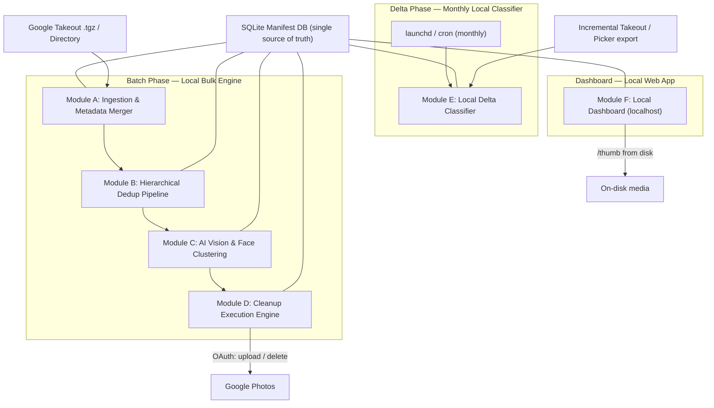
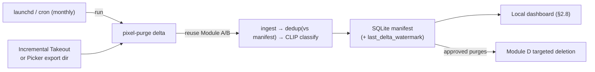

# Pixel Purge — Product Requirements Document

**Google Photos Cleanup, Classification, and Deduplication Agent System**

| Field | Value |
|---|---|
| **Version** | 1.1 |
| **Date** | 2026-08-04 |
| **Status** | Draft — Pending Approval |
| **Repository** | `pixel-purge` |
| **Target Platform** | macOS (Apple Silicon M1 Max, 32GB) primary; Linux/Windows secondary |

---

## 1. Executive Summary & Goals

### 1.1 Vision

Pixel Purge is a **fully local-first** photo management system that solves the fundamental problem of Google Photos library entropy: years of accumulated duplicates, screenshots, receipts, and junk media that consume storage and degrade the library's usefulness. All processing, storage, ML inference, and the dashboard run on the user's own machine — **no cloud hosting, no serverless components, no third-party data store**. The only network interaction is with Google Photos itself (for the re-upload / targeted-delete step), using the user's own OAuth credentials.

The system operates in two modes:

1. **Batch Phase (Local Bulk Engine):** A one-time deep clean of the entire library via Google Takeout export — deduplication, AI classification, face clustering, and curated cleanup.
2. **Delta Phase (Monthly Local Classifier):** A monthly, locally-run triage of newly added photos (via an incremental Takeout or Photos Picker export) using on-device AI to prevent entropy from re-accumulating. Scheduled with `launchd`/`cron` on the user's Mac.

### 1.2 Target User Persona

| Attribute | Detail |
|---|---|
| **Name** | "Vishnu" — Power User |
| **Library Size** | 50GB+, 20,000+ items |
| **Pain Point** | Google Photos provides no bulk cleanup, no duplicate detection, and no automated classification beyond basic search |
| **Technical Comfort** | Can run CLI tools, set up Google OAuth desktop credentials, run a local dev server |
| **Hardware** | Mac M1 Max, 32GB RAM |

### 1.3 Primary Success Metrics

| Metric | Target |
|---|---|
| Storage reclaimed | ≥30% of original library size |
| Duplicate detection recall | ≥95% (exact + near-duplicate) |
| Manual cleanup time reduction | ≥90% vs. manual Google Photos UI deletion |
| False positive deletion rate | <0.1% (no precious photos auto-deleted) |
| Monthly classification latency | <15 minutes for ~500 new photos (local, on-device) |
| Cloud infrastructure cost | $0.00/month — fully local, no hosted services provisioned |
| Pipeline resumability | 100% — no work lost on crash or interrupt |

---

## 2. System Architecture & Component Specifications

### 2.1 High-Level Architecture

Everything below runs on the user's Mac. The only external endpoint is Google Photos, reached over the user's own OAuth credentials for the cleanup (upload / targeted delete) step.



### 2.2 Technology Stack

| Component | Technology |
|---|---|
| Language | Python 3.11+ |
| CLI Framework | Typer (with `rich` integration) |
| Data Store | SQLite 3 (WAL mode) with CSV export |
| Binary Hashing | `hashlib` (SHA-256) |
| Perceptual Hashing | `imagehash` (pHash) |
| Vision Model | open_clip `ViT-B-32` (`laion2b_s34b_b79k`) zero-shot via PyTorch MPS |
| Face Detection/Embedding | InsightFace `buffalo_l` via ONNX Runtime (CoreML EP on M-series) |
| Face Clustering | `scikit-learn` DBSCAN |
| Video Keyframe | `ffmpeg-python` |
| Browser Automation | Playwright |
| Google Photos API | `google-api-python-client` + `google-auth-oauthlib` (upload / delete only) |
| Delta Classifier | Local CLIP zero-shot (`open_clip` / `transformers`) — unified taxonomy, on-device |
| Delta Scheduler | `launchd` (macOS) / `cron` — runs the local `pixel-purge delta` command |
| Dashboard Framework | SvelteKit (dev/static build) served locally |
| Dashboard Server | Local FastAPI + `uvicorn` (`localhost`), reads SQLite + streams thumbnails from disk |
| Secret Management | macOS Keychain (`keyring`) — OAuth token stored locally |
| Progress UI | `rich.progress` + `rich.table` |
| Packaging | `pyproject.toml` with entry points |
| Testing | `pytest` with synthetic fixtures |

---

### 2.3 Module A: Ingestion & Metadata Merger

#### Purpose
Parse Google Takeout exports (`.tgz` archives or extracted directories), discover all media files, merge stripped EXIF metadata from companion `.json` sidecar files back into the manifest, and extract video keyframes.

#### Input Formats
- **Archives:** One or more `takeout-*.tgz` files (auto-detected by extension)
- **Directory:** Pre-extracted Takeout directory tree
- **Auto-detection:** CLI inspects the input path and determines format automatically

#### Sidecar JSON Resolution Algorithm

Google Takeout uses inconsistent sidecar naming conventions. The merger must attempt resolution in this priority order:

```
Priority 1: {filename}.json                    (e.g., IMG_1234.jpg.json)
Priority 2: {filename}.supplemental-metadata.json
Priority 3: {stem}-edited.json                 (for edited copies)
Priority 4: {stem}({n}).json                   (for duplicate-named exports)
Priority 5: Match by photoTakenTime within same directory (±2s tolerance)
```

#### Fields Extracted from Sidecar JSON

| JSON Field | Manifest Column | Type | Nullable |
|---|---|---|---|
| `photoTakenTime.timestamp` | `taken_timestamp` | INTEGER (Unix epoch) | YES |
| `geoData.latitude` | `latitude` | REAL | YES |
| `geoData.longitude` | `longitude` | REAL | YES |
| `geoDataExif.latitude` | `latitude` (fallback) | REAL | YES |
| `geoDataExif.longitude` | `longitude` (fallback) | REAL | YES |
| `description` | `user_description` | TEXT | YES |
| `title` | `original_title` | TEXT | YES |
| `imageViews` | `view_count` | INTEGER | YES |
| `creationTime.timestamp` | `creation_timestamp` | INTEGER (Unix epoch) | YES |

#### Video Keyframe Extraction

For video files (`.mp4`, `.mov`, `.avi`, `.mkv`, `.3gp`, `.webm`):

```python
# Extract single keyframe at t=1s (or t=0s if video < 1s)
ffmpeg -i {video_path} -ss 1 -frames:v 1 -q:v 2 {output_dir}/{stem}_keyframe.jpg
```

The extracted keyframe is stored alongside the video and used for all subsequent visual analysis (pHash, CLIP, face detection).

#### CLI Interface

```bash
# Ingest from extracted directory
pixel-purge ingest ~/Downloads/Takeout/Google\ Photos/

# Ingest from .tgz archives
pixel-purge ingest ~/Downloads/takeout-*.tgz

# Resume interrupted ingestion
pixel-purge ingest ~/Downloads/Takeout/ --resume

# Dry run — report what would be ingested
pixel-purge ingest ~/Downloads/Takeout/ --dry-run
```

#### Checkpoint & Resumability

- Each successfully processed file is recorded in the `media_items` SQLite table with `ingestion_status = 'COMPLETE'`
- On resume, the module queries for files in the source directory not yet present in the DB
- Progress displayed via `rich.progress.Progress` bar showing files processed / total discovered

#### Pseudo-code

```python
def ingest(source_path: Path, db: Database, resume: bool = True):
    """Module A: Ingest and merge metadata from Google Takeout export."""

    # 1. Determine input type
    if source_path.suffix == '.tgz' or any(source_path.glob('*.tgz')):
        archives = sorted(source_path.parent.glob('takeout-*.tgz'))
        extract_dir = source_path.parent / '.pixel-purge-extracted'
        for archive in archives:
            extract_tgz(archive, extract_dir)
        media_root = extract_dir
    else:
        media_root = source_path

    # 2. Discover all media files
    MEDIA_EXTENSIONS = {'.jpg', '.jpeg', '.png', '.gif', '.heic', '.heif',
                        '.webp', '.bmp', '.tiff', '.raw', '.cr2', '.nef',
                        '.mp4', '.mov', '.avi', '.mkv', '.3gp', '.webm'}
    all_files = [f for f in media_root.rglob('*')
                 if f.suffix.lower() in MEDIA_EXTENSIONS]

    # 3. Filter already-processed files on resume
    if resume:
        processed = db.get_processed_filenames()
        all_files = [f for f in all_files if f.name not in processed]

    # 4. Process each file
    with Progress() as progress:
        task = progress.add_task("Ingesting media...", total=len(all_files))
        for media_file in all_files:
            record = MediaRecord(filename=media_file.name,
                                 local_path=str(media_file),
                                 file_size=media_file.stat().st_size,
                                 media_type=classify_media_type(media_file))

            # 4a. Resolve and merge sidecar JSON
            sidecar = resolve_sidecar(media_file)
            if sidecar:
                merge_sidecar_metadata(record, sidecar)

            # 4b. Fall back to embedded EXIF if sidecar missing
            if not record.taken_timestamp:
                extract_exif_metadata(record, media_file)

            # 4c. Extract video keyframe
            if record.media_type == 'VIDEO':
                keyframe_path = extract_keyframe(media_file)
                record.keyframe_path = str(keyframe_path)

            # 4d. Insert into database
            db.insert_media_record(record)
            progress.advance(task)
```

---

### 2.4 Module B: Hierarchical Deduplication Pipeline

#### Purpose
Identify and flag duplicate media items using a 3-tier hierarchical approach that reduces the O(N²) visual comparison problem to a tractable computation.

#### Tier 1: Exact Binary Hash Dedup — O(N)

```python
def tier1_exact_hash(db: Database):
    """SHA-256 hash for exact bit-level duplicate detection."""
    with Progress() as progress:
        unprocessed = db.get_items_without_hash()
        task = progress.add_task("Hashing files...", total=len(unprocessed))

        for item in unprocessed:
            file_hash = sha256_file(item.local_path)
            db.update_hash(item.id, file_hash)
            progress.advance(task)

    # Group by hash — any group with count > 1 contains exact duplicates
    duplicate_groups = db.query("""
        SELECT sha256_hash, COUNT(*) as cnt, GROUP_CONCAT(id) as ids
        FROM media_items
        GROUP BY sha256_hash
        HAVING cnt > 1
    """)

    for group in duplicate_groups:
        keeper = select_keeper(group.ids)  # Keep oldest or highest-resolution
        for dupe_id in group.ids:
            if dupe_id != keeper:
                db.flag_duplicate(dupe_id, duplicate_of=keeper,
                                  dedup_tier='EXACT_HASH')
```

**Keeper Selection Logic:** When exact duplicates are found, retain the copy with:
1. Richest metadata (most non-null sidecar fields)
2. Earliest `taken_timestamp` (original)
3. Longest filename (often contains original camera naming)

#### Tier 2: Spatiotemporal Partitioning — O(N)

Partition the remaining (non-exact-duplicate) items into buckets by GPS proximity and temporal proximity. This constrains the expensive Tier 3 visual comparison to small, local groups.

**Bucketing Parameters (configurable via CLI):**

| Parameter | Default | CLI Flag |
|---|---|---|
| GPS Radius | 100 meters | `--gps-radius` |
| Time Window | ±30 minutes | `--time-window` |

**GPS-less Fallback:** Items with no GPS coordinates are bucketed by **time-only** (±30 min windows). This correctly groups burst screenshots, sequential downloads, and rapid-fire photos taken indoors.

```python
def tier2_spatiotemporal_partition(db: Database,
                                   gps_radius_m: float = 100.0,
                                   time_window_min: int = 30) -> List[Bucket]:
    """Group non-duplicate items into spatiotemporal buckets."""
    items = db.get_non_duplicate_items()
    buckets = []

    # Separate GPS-bearing and GPS-less items
    gps_items = [i for i in items if i.latitude is not None]
    no_gps_items = [i for i in items if i.latitude is None]

    # GPS items: cluster by location first, then subdivide by time
    gps_items.sort(key=lambda x: (x.latitude, x.longitude))
    spatial_clusters = cluster_by_gps(gps_items, radius_m=gps_radius_m)

    for spatial_group in spatial_clusters:
        temporal_buckets = subdivide_by_time(spatial_group,
                                             window_min=time_window_min)
        buckets.extend(temporal_buckets)

    # GPS-less items: cluster by time only
    no_gps_items.sort(key=lambda x: x.taken_timestamp or 0)
    time_buckets = subdivide_by_time(no_gps_items,
                                      window_min=time_window_min)
    buckets.extend(time_buckets)

    return buckets


def cluster_by_gps(items: List[MediaRecord],
                   radius_m: float) -> List[List[MediaRecord]]:
    """Greedy clustering: start a new cluster when distance exceeds radius."""
    clusters = []
    current_cluster = [items[0]]

    for item in items[1:]:
        dist = haversine(current_cluster[0].latitude,
                         current_cluster[0].longitude,
                         item.latitude, item.longitude)
        if dist <= radius_m:
            current_cluster.append(item)
        else:
            clusters.append(current_cluster)
            current_cluster = [item]

    clusters.append(current_cluster)
    return clusters
```

#### Tier 3: Visual Perceptual Hash Comparison — O(B × K²)

Within each spatiotemporal bucket (typically 2–20 items), compute pHash and compare all pairs. This reduces the global O(N²) to O(B × K²) where B = number of buckets and K = average bucket size.

**Hamming Distance Threshold:** ≤ 10 bits (out of 64-bit pHash). This catches:
- Re-compressed JPEGs (typically 0–4 bits different)
- Slight crops or rotations (typically 4–8 bits different)
- Screenshot variants with minor text changes (typically 6–10 bits different)

```python
def tier3_visual_dedup(db: Database, buckets: List[Bucket],
                       hamming_threshold: int = 10):
    """pHash comparison within spatiotemporal buckets."""
    with Progress() as progress:
        task = progress.add_task("Visual dedup...", total=len(buckets))

        for bucket in buckets:
            if len(bucket.items) < 2:
                progress.advance(task)
                continue

            # Compute pHash for each item in bucket
            for item in bucket.items:
                img_path = item.keyframe_path or item.local_path
                phash = compute_phash(img_path)  # imagehash.phash()
                db.update_phash(item.id, str(phash))

            # Pairwise comparison within bucket
            for i, item_a in enumerate(bucket.items):
                for item_b in bucket.items[i+1:]:
                    distance = hamming_distance(item_a.phash, item_b.phash)
                    if distance <= hamming_threshold:
                        keeper = select_keeper([item_a.id, item_b.id])
                        dupe = item_b.id if keeper == item_a.id else item_a.id
                        db.flag_duplicate(dupe, duplicate_of=keeper,
                                          dedup_tier='VISUAL_PHASH',
                                          hamming_distance=distance)

            # Assign phash_cluster_id to groups of visual duplicates
            assign_phash_clusters(db, bucket)
            progress.advance(task)
```

#### CLI Interface

```bash
# Run full dedup pipeline (all 3 tiers)
pixel-purge dedup

# Run with custom thresholds
pixel-purge dedup --gps-radius 200 --time-window 60 --hamming-threshold 8

# Dry run — report duplicate candidates without flagging
pixel-purge dedup --dry-run

# Run specific tier only
pixel-purge dedup --tier 1  # exact hash only
pixel-purge dedup --tier 2  # spatiotemporal bucketing only
pixel-purge dedup --tier 3  # visual comparison only (requires tier 2)

# Show dedup statistics
pixel-purge dedup --stats
```

#### Expected Performance (M1 Max, 20K items)

| Tier | Time Complexity | Estimated Time |
|---|---|---|
| Tier 1 (SHA-256) | O(N) | ~5 minutes |
| Tier 2 (Bucketing) | O(N log N) | ~30 seconds |
| Tier 3 (pHash) | O(B × K²), K ≈ 5 avg | ~15 minutes |
| **Total** | | **~20 minutes** |

---

### 2.5 Module C: Local AI Vision & Unsupervised Face Clustering

#### Purpose
Enrich each non-duplicate media item with a unified-taxonomy classification (scene/object
understanding + screenshot/document/blur detection) and cluster human faces across the library
without manual labeling. All inference is on-device (MPS with CPU fallback); nothing leaves the
machine.

> [!NOTE]
> This section reflects the Phase 2 implementation, which supersedes the v1.0 design (BLIP captioning
> + keyword rules; `face_recognition`/dlib). Rationale is tracked as findings **[H2]** and **[H4]**
> in [`pixel-purge-prd-review.md`](./pixel-purge-prd-review.md): CLIP zero-shot gives taxonomy parity
> with the Module E delta classifier and avoids brittle caption-keyword matching; InsightFace
> installs cleanly on Apple Silicon (dlib has no MPS backend) and is more accurate.

#### C.1: Vision Classification (CLIP zero-shot)

**Model:** open_clip `ViT-B-32` (`laion2b_s34b_b79k`), lazy-loaded via the `[vision]` extra
**Backend:** PyTorch, device auto-detect (`mps` → `cpu`)
**Taxonomy:** the four unified buckets shared with Module E — `ADHOC_PURGE`, `TRIP`, `FAMILY_KEEP`,
`OTHER` (`vision/taxonomy.py`).

CLIP scores each image against a set of natural-language label prompts (each mapped to one bucket),
which is far more robust than captioning-then-keyword-matching and yields a per-bucket confidence for
free. The result is then fused with two cheap **pure-numpy** quality signals (no OpenCV), so blur and
text-density are real and unit-testable:

- **`blur_score`** — variance of a 3×3 Laplacian convolution. Low variance ⇒ few sharp edges ⇒ blurry
  (threshold 50).
- **`text_density`** — fraction of pixels whose normalized `|Laplacian|` exceeds a fixed cutoff. High,
  evenly-spread edges ⇒ screenshot/document (threshold 0.30). A cheap proxy for "text-heavy", not real
  OCR.

```python
# vision/clip_tagger.py — pure, testable decision logic (model-free)
def fuse_classification(prompt_probs: dict[str, float], blur: float,
                        density: float) -> ClassificationResult:
    # Aggregate CLIP prompt probabilities to bucket level for a stable confidence.
    bucket_prob = {b: 0.0 for b in BUCKETS}
    for p, prob in prompt_probs.items():
        bucket_prob[prompt_bucket(p)] += prob
    top = max(prompt_probs, key=prompt_probs.get)
    clip_bucket, clip_label = prompt_bucket(top), prompt_label(top)

    # Override 1: text-heavy (screenshot/document) beats the CLIP subject.
    if is_text_heavy(density):
        return ClassificationResult(ADHOC_PURGE, max(bucket_prob[clip_bucket], density),
                                    "text_heavy", ..., blur, density)
    # Override 2: blurry — unless CLIP is confident this is a family/person shot.
    if is_blurry(blur) and not (clip_bucket == FAMILY_KEEP and prompt_probs[top] > 0.5):
        return ClassificationResult(ADHOC_PURGE, max(0.5, bucket_prob[clip_bucket]),
                                    "blurry", ..., blur, density)
    return ClassificationResult(clip_bucket, bucket_prob[clip_bucket], clip_label, ..., blur, density)
```

Each item's `classification_bucket`, `classification_confidence`, `classification_reasoning`,
`ai_label`, `blur_score`, and `ocr_text_ratio` are written to the manifest; `vision_status` gates
resume. **Vision only labels — it never deletes.** Purge candidates surface in review (§2.6, TUI) and
the dashboard (§2.8).

#### C.2: Human Face Clustering (InsightFace + DBSCAN)

**Embedding:** InsightFace `buffalo_l` (512-d, L2-normalized) via ONNX Runtime, lazy-loaded via the
`[faces]` extra. On Apple Silicon it uses the **CoreML execution provider** (falls back to CPU).
**Clustering:** `scikit-learn` DBSCAN, `metric='cosine'`, `eps=0.45`, **`min_samples=2`**.

`min_samples=2` (not 3) so a person appearing in only two photos still forms a cluster instead of
being discarded as noise — important for personal libraries **[H4]**.

```python
# vision/faces.py
def run_face_clustering(db, eps=0.45, min_samples=2):
    analyzer = InsightFaceAnalyzer()          # buffalo_l, CoreML EP on M-series
    extract_faces(db, analyzer)               # -> face_embeddings (embedding blob + bbox)

    rows = db.get_all_face_embeddings()
    matrix = np.vstack([embedding_from_bytes(r["embedding"]) for r in rows])
    labels = cluster_faces(matrix, eps=eps, min_samples=min_samples)  # DBSCAN, cosine
    assign_person_clusters(db, rows, labels)  # person_XXXX ids; -1 -> unclustered (None)
```

Faces are stored in the normalized `face_embeddings` table (512-d float32 blob, plus bounding box);
`person_cluster_id` is assigned per face and aggregated onto `media_items.person_cluster_ids` (JSON).
`face_status` gates resume.

#### CLI Interface

```bash
# Full vision + face clustering pipeline
pixel-purge classify

# Only one stage
pixel-purge classify --vision-only
pixel-purge classify --faces-only

# Custom DBSCAN parameters
pixel-purge classify --faces-only --eps 0.50 --min-samples 3

# Statistics (works with no ML deps installed)
pixel-purge classify --stats
```

#### Expected Performance (M1 Max, 20K items)

| Operation | Notes | Estimated Total |
|---|---|---|
| CLIP classification (MPS) | batched image encode | ~20–35 minutes |
| Face detect + embed (InsightFace, CoreML) | | ~30–50 minutes |
| DBSCAN clustering | | ~seconds |
| **Total** | | **~1 hour** |

> [!NOTE]
> The `[vision]`/`[faces]` extras (torch, open_clip, insightface, onnxruntime, scikit-learn) are only
> needed to *run* `classify`. The rest of the CLI and the entire test suite work without them, because
> the model layers are lazy-imported and the decision/clustering logic is unit-tested with mocked
> embeddings.

---

### 2.6 Module D: Cloud Cleanup Execution Engine

#### Purpose
Execute the actual cleanup of the Google Photos cloud library based on the manifest decisions. Supports two strategies with full human review before any destructive action.

#### Authentication

```python
SCOPES = [
    'https://www.googleapis.com/auth/photoslibrary',
    'https://www.googleapis.com/auth/photoslibrary.appendonly',
    'https://www.googleapis.com/auth/photoslibrary.sharing',
]

def authenticate_local():
    """OAuth 2.0 Desktop App flow for local CLI usage."""
    creds = None
    token_path = Path.home() / '.pixel-purge' / 'token.json'
    client_secret_path = Path.home() / '.pixel-purge' / 'client_secret.json'

    if token_path.exists():
        creds = Credentials.from_authorized_user_file(str(token_path), SCOPES)

    if not creds or not creds.valid:
        if creds and creds.expired and creds.refresh_token:
            creds.refresh(Request())
        else:
            flow = InstalledAppFlow.from_client_secrets_file(
                str(client_secret_path), SCOPES)
            creds = flow.run_local_server(port=0)
        token_path.parent.mkdir(parents=True, exist_ok=True)
        token_path.write_text(creds.to_json())

    return build('photoslibrary', 'v1', credentials=creds,
                 static_discovery=False)
```

#### Strategy 1: Clean Slate (Primary)

**Workflow:**
1. **Pre-flight Audit:** Display manifest summary — items to keep vs. discard
2. **Human Review:** Rich TUI table showing flagged items, user confirms batch-by-batch
3. **Local Curation:** Copy keeper files to a clean staging directory
4. **Metadata Restoration:** Write restored EXIF data (GPS, timestamps) back into files via `piexif`
5. **Manual Cloud Wipe:** User manually selects all photos in Google Photos web UI and deletes (API cannot do this)
6. **Programmatic Re-upload:** Upload curated set via `mediaItems:batchCreate` with rate limiting
7. **Album Reconstruction:** Recreate album structure from manifest metadata

```python
def execute_clean_slate(db: Database, service, staging_dir: Path):
    """Strategy 1: Clean slate — curate locally, wipe cloud, re-upload."""

    # Step 1: Build curated file list
    keepers = db.get_keeper_items()  # Items NOT flagged as duplicates
    console.print(f"[bold]Clean Slate Summary:[/bold]")
    console.print(f"  Total items: {db.get_total_count()}")
    console.print(f"  Keeping: {len(keepers)}")
    console.print(f"  Discarding: {db.get_total_count() - len(keepers)}")

    # Step 2: Interactive TUI review
    if not confirm_with_tui(keepers, db):
        console.print("[yellow]Aborted by user.[/yellow]")
        return

    # Step 3: Copy keepers to staging directory
    staging_dir.mkdir(parents=True, exist_ok=True)
    with Progress() as progress:
        task = progress.add_task("Staging files...", total=len(keepers))
        for item in keepers:
            dest = staging_dir / item.filename
            shutil.copy2(item.local_path, dest)
            restore_exif(dest, item)  # Write GPS + timestamp back to EXIF
            progress.advance(task)

    # Step 4: Prompt user for manual cloud wipe
    console.print("\n[bold red]⚠️  ACTION REQUIRED:[/bold red]")
    console.print("  1. Open photos.google.com in your browser")
    console.print("  2. Select ALL photos (Ctrl+A / Cmd+A)")
    console.print("  3. Delete them and empty trash")
    console.print("  4. Wait 1 hour for deletion to propagate")

    if not Confirm.ask("Have you completed the cloud wipe?"):
        console.print("[yellow]Paused. Run `pixel-purge cleanup "
                      "--resume-upload` when ready.[/yellow]")
        return

    # Step 5: Re-upload curated set
    upload_to_google_photos(service, staging_dir, db)


def upload_to_google_photos(service, staging_dir: Path, db: Database):
    """Upload files via Google Photos API with rate limiting and resume."""
    files = sorted(staging_dir.iterdir())
    uploaded = db.get_uploaded_filenames()
    remaining = [f for f in files if f.name not in uploaded]

    BATCH_SIZE = 50
    RATE_LIMIT_DELAY = 0.8  # ~75 requests/min

    with Progress() as progress:
        task = progress.add_task("Uploading...", total=len(remaining))

        for batch in chunked(remaining, BATCH_SIZE):
            upload_tokens = []
            for file_path in batch:
                # Step 5a: Upload bytes to get upload token
                token = upload_media_bytes(service, file_path)
                upload_tokens.append((file_path, token))
                time.sleep(RATE_LIMIT_DELAY)

            # Step 5b: Create media items from upload tokens
            new_items = [
                {'simpleMediaItem': {
                    'uploadToken': token,
                    'fileName': path.name
                }}
                for path, token in upload_tokens
            ]

            result = service.mediaItems().batchCreate(
                body={'newMediaItems': new_items}
            ).execute()

            # Step 5c: Record upload status
            for item_result in result.get('newMediaItemResults', []):
                status = item_result.get('status', {})
                if status.get('code') == 0:  # OK
                    db.mark_uploaded(item_result['mediaItem']['filename'])

            progress.advance(task, advance=len(batch))
```

#### Strategy 2: Browser Automation (Secondary)

**Workflow:**
1. **Generate deletion manifest:** List of filenames to delete
2. **Launch Playwright browser:** Navigate to `photos.google.com`
3. **For each deletion candidate:** Search by filename → select → delete
4. **Rate limiting:** 5-second delay between operations to avoid security flags

```python
async def execute_browser_automation(db: Database):
    """Strategy 2: Playwright-based targeted deletion."""

    deletions = db.get_items_flagged_for_deletion()

    console.print(f"[bold]Browser Automation:[/bold] {len(deletions)} items "
                  f"to delete")
    console.print("[yellow]⚠️  This will open a browser window. "
                  "You may need to log in to Google Photos.[/yellow]")

    if not Confirm.ask("Proceed?"):
        return

    async with async_playwright() as p:
        browser = await p.chromium.launch(headless=False)
        context = await browser.new_context(
            storage_state=get_browser_state_path()  # Reuse login session
        )
        page = await context.new_page()

        with Progress() as progress:
            task = progress.add_task("Deleting...", total=len(deletions))

            for item in deletions:
                try:
                    # Navigate to search
                    search_url = (f"https://photos.google.com/search/"
                                  f"{quote(item.filename)}")
                    await page.goto(search_url)
                    await page.wait_for_timeout(3000)

                    # Find and select the photo
                    photo_el = await page.query_selector(
                        f'[aria-label*="{item.filename}"]')
                    if photo_el:
                        await photo_el.click()
                        await page.wait_for_timeout(1000)

                        # Click delete button
                        delete_btn = await page.query_selector(
                            '[aria-label="Delete"]')
                        if delete_btn:
                            await delete_btn.click()
                            await page.wait_for_timeout(1000)

                            # Confirm deletion
                            confirm_btn = await page.query_selector(
                                'button:has-text("Move to trash")')
                            if confirm_btn:
                                await confirm_btn.click()
                                db.mark_deleted(item.id)

                    await page.wait_for_timeout(5000)  # Rate limit

                except Exception as e:
                    db.log_deletion_error(item.id, str(e))

                progress.advance(task)

        await browser.close()
```

> [!WARNING]
> Browser Automation is inherently fragile. Google frequently updates their web UI DOM structure. Selectors may break without notice. This strategy should be considered experimental and requires manual verification after each run.

#### CLI Interface

```bash
# Interactive TUI review of all flagged items
pixel-purge review

# Execute Clean Slate strategy
pixel-purge cleanup --strategy clean-slate --staging-dir ~/pixel-purge-staging/

# Execute Browser Automation strategy
pixel-purge cleanup --strategy browser-auto

# Resume interrupted upload (Clean Slate)
pixel-purge cleanup --resume-upload

# Dry run — show what would be deleted/uploaded
pixel-purge cleanup --strategy clean-slate --dry-run

# Export deletion manifest as CSV
pixel-purge export --format csv --output manifest.csv
```

---

### 2.7 Module E: Monthly Local Delta Classifier

#### Purpose
Classify photos added since the last run into the unified taxonomy (see §2.5), flag purge
candidates for review, and record results in the local SQLite manifest for the dashboard — **entirely
on-device**. No serverless components, no cloud data store, no third-party inference.

> [!IMPORTANT]
> **Why local (not serverless):** Two independent reasons. (1) **Privacy/simplicity** — the whole
> product is local-first; the delta phase stays on-device so no images or metadata leave the machine.
> (2) **API reality (2025-04-01):** Google removed the `photoslibrary`, `photoslibrary.readonly`, and
> `photoslibrary.sharing` scopes; `mediaItems.search`/`list`/`batchGet` now return **only media your
> app created**, so a cloud worker cannot enumerate "photos added in the last 30 days" anyway.
> The delta source is therefore an **incremental Google Takeout** (or a Photos Picker export the user
> triggers), processed by the same local pipeline as the batch phase.

#### Unified Taxonomy

The batch phase (§2.5) and the delta phase emit the **same** labels, so a photo classified in either
pipeline is consistent:

| Bucket | Meaning |
|---|---|
| `ADHOC_PURGE` | Screenshots, receipts, documents, memes, blurry, QR/text-heavy — deletion candidates |
| `TRIP` | Travel/landmarks/unfamiliar locations (GPS-verified when coordinates present) |
| `FAMILY_KEEP` | People (esp. family/children), gatherings, pets, meaningful moments |
| `OTHER` | Unclassified / low-confidence — always routed to human review, never auto-purged |

#### Flow (`pixel-purge delta`)

Runs on the user's Mac via `launchd`/`cron` (monthly) or on demand. The delta is simply the **batch
pipeline over a small new input**, deduplicated against the existing manifest, so no new-photo API
read is needed and all inference stays local.



**Local classifier [H2]:** a **CLIP zero-shot** model scores each image against the taxonomy prompts
directly (open-vocabulary), running on MPS with CPU fallback — the same device story as Module C. No
caption-keyword heuristics, and it emits a per-bucket confidence for free.

**Watermark-based idempotency [H5]:** persist the max `taken_timestamp` processed; classify only
items newer than it. This removes the calendar-month-vs-rolling-30-day drift and any double-staging.

```python
def delta_run(db: Database, source_path: Path):
    """Module E (local): classify only items newer than the last watermark."""
    watermark = db.get_delta_watermark()          # max taken_timestamp last processed, or 0

    # Reuse Module A/B — ingest new input, dedup against the FULL existing manifest
    ingest(source_path, db, resume=True)
    run_dedup_pipeline(db)                          # catches re-downloads/re-shares vs old items

    new_items = db.get_items_since(watermark)       # taken_timestamp > watermark, unclassified
    classifier = ZeroShotClassifier(device='auto')  # local CLIP zero-shot, unified taxonomy [H2]

    for item in new_items:
        result = classifier.classify(item)          # returns (bucket, confidence, reasoning)
        result = apply_gps_override(result, item)    # local haversine; > TRIP_DISTANCE ⇒ TRIP
        db.update_classification(item.id, result)

    db.set_delta_watermark(max((i.taken_timestamp or 0) for i in new_items) or watermark)
    console.print(f"[green]Delta: classified {len(new_items)} new items.[/green]")
```

**CLI:**
```bash
# Classify a new incremental Takeout (or Picker export) since the last run
pixel-purge delta ~/Downloads/takeout-2026-08.tgz

# Re-run without advancing the watermark (idempotent preview)
pixel-purge delta ~/Downloads/takeout-2026-08/ --dry-run

# Show delta history and per-bucket counts
pixel-purge delta --stats
```

#### Scheduling (`launchd`)

A `launchd` agent runs the command monthly and (optionally) posts a local notification when review
candidates are ready:

```xml
<!-- ~/Library/LaunchAgents/com.pixelpurge.delta.plist -->
<dict>
  <key>Label</key><string>com.pixelpurge.delta</string>
  <key>ProgramArguments</key>
  <array>
    <string>/usr/bin/env</string><string>pixel-purge</string>
    <string>delta</string><string>--notify</string>
  </array>
  <key>StartCalendarInterval</key>
  <dict><key>Day</key><integer>1</integer><key>Hour</key><integer>9</integer></dict>
</dict>
```

#### Network boundary

The **only** network interaction in the entire system is Module D acting on approved decisions:
upload of curated files via `mediaItems:batchCreate` + `photoslibrary.appendonly`, and targeted
deletion. Classification never touches the network.

#### Configuration (delta)

```toml
[delta]
trip_distance_miles = 50
model = "ViT-B-32"        # local CLIP checkpoint for zero-shot classification
device = "auto"          # auto, mps, cpu
notify = true            # local macOS notification when review candidates are ready
```

---

### 2.8 Module F: Local Dashboard

#### Purpose
Provide the unified control center — review/approval/analytics for all three data sets (delta
classifications, dedup clusters, face clusters) as a **single local web app** served from
`localhost`. It reads the SQLite manifest directly and streams thumbnails from disk, so there is no
cloud hosting, no auth provider, and no third-party data store.

> [!NOTE]
> This replaces the v1.0 hosted PWA (Firebase Hosting/Auth/Firestore) and the
> `pixel-purge sync-dashboard` upload command. Because the dashboard runs on the same machine as the
> library, it can load local files directly — a hosted browser app cannot read `file:///…`, which is
> why the earlier Dedup/Face views could not have rendered `[C3]`. Binding to `localhost` also means
> no auth layer is required; the OS user boundary is the security boundary.

#### Architecture

```mermaid
graph LR
    BROWSER["Browser @ localhost:8787"] --> LSRV["Local server (FastAPI / uvicorn)"]
    LSRV -->|read/write| DB["SQLite manifest.db"]
    LSRV -->|/thumb/{id}| DISK["On-disk media (downscaled + cached)"]
    UI["SvelteKit build (served by the local server)"] --> BROWSER
```

The SvelteKit front-end is built once (`npm run build`) and served as static assets by the same local
FastAPI process that exposes the data + thumbnail endpoints. `pixel-purge dashboard` starts it and
opens the browser.

**Thumbnail endpoint** — streams a downscaled JPEG from disk; the piece that makes every view render:

```python
from fastapi import FastAPI, HTTPException
from fastapi.responses import Response
from PIL import Image
import io

app = FastAPI()

@app.get("/thumb/{item_id}")
def thumb(item_id: int, size: int = 256):
    item = DB.get_item(item_id)
    if not item:
        raise HTTPException(404)
    src = item.keyframe_path or item.local_path        # keyframe for videos
    img = Image.open(src).convert("RGB")               # requires pillow-heif/rawpy for HEIC/RAW [M3]
    img.thumbnail((size, size))
    buf = io.BytesIO(); img.save(buf, "JPEG", quality=82)
    return Response(buf.getvalue(), media_type="image/jpeg",
                    headers={"Cache-Control": "private, max-age=86400"})
```

#### Views

##### F.1 — Delta Review (`/review`)
Thumbnail grid of the latest (or any past) delta run, read from the manifest.
- **Bucket filter tabs:** `ADHOC_PURGE` / `TRIP` / `FAMILY_KEEP` / `OTHER` / `ALL`
- **Per-item actions:** Approve ✅ / Reject ❌ (writes `keeper_status` back to SQLite)
- **Batch actions:** "Approve all in bucket", "Reject all in bucket"
- **Confidence badge:** green >0.9, yellow 0.7–0.9, red <0.7
- **Reasoning tooltip:** the classifier's per-bucket rationale
- **Run selector + summary bar:** counts per bucket, approval progress
- Approved `ADHOC_PURGE` items feed Module D targeted deletion.

##### F.2 — Dedup Viewer (`/dedup`)
Side-by-side comparison of duplicate clusters from the local pipeline.
- **Cluster cards:** 2–N similar photos side-by-side via `/thumb/{id}`
- **Keeper highlight:** auto-selected keeper outlined green; user can override
- **Metadata comparison:** size, resolution, timestamp, GPS per item
- **Tier badge:** `EXACT_HASH` or `VISUAL_PHASH` (+ Hamming distance)
- **Filter/sort:** by cluster size, tier, file-size savings
- Writes keeper overrides directly to SQLite.

##### F.3 — Face Gallery (`/faces`)
Browse and manage detected person clusters.
- **Person grid:** representative face + photo count per cluster
- **Drill-down:** all photos containing that face
- **Name assignment:** label a cluster ("Mom", "Dad")
- **Merge / split:** fix DBSCAN over/under-splits
- Writes names/merges directly to SQLite.

#### CLI

```bash
# Launch the local dashboard (builds if needed, opens http://localhost:8787)
pixel-purge dashboard

# Custom port
pixel-purge dashboard --port 9000

# Serve without auto-opening the browser (e.g. headless)
pixel-purge dashboard --no-open
```

#### Front-end build

```bash
cd dashboard/
npm run build            # static assets served by the local FastAPI process
```

No Firebase, no service worker, no remote hosting. The dashboard is available only while
`pixel-purge dashboard` is running on the user's machine.

---

## 3. Data Schemas & Manifest Specifications

### 3.1 SQLite Database Schema

**Database file:** `~/.pixel-purge/manifest.db`

```sql
-- Core media items table
CREATE TABLE IF NOT EXISTS media_items (
    id                    INTEGER PRIMARY KEY AUTOINCREMENT,
    filename              TEXT NOT NULL,
    local_path            TEXT NOT NULL UNIQUE,
    file_size             INTEGER NOT NULL,
    media_type            TEXT NOT NULL CHECK(media_type IN ('PHOTO', 'VIDEO')),

    -- Timestamps
    taken_timestamp       INTEGER,        -- Unix epoch from sidecar/EXIF
    creation_timestamp    INTEGER,        -- File creation time
    ingestion_timestamp   INTEGER NOT NULL DEFAULT (strftime('%s', 'now')),

    -- Geolocation
    latitude              REAL,
    longitude             REAL,

    -- Sidecar metadata
    user_description      TEXT,
    original_title        TEXT,

    -- Module B: Deduplication
    sha256_hash           TEXT,
    phash                 TEXT,           -- 16-char hex perceptual hash
    phash_cluster_id      INTEGER,        -- Group ID for visual duplicates
    is_duplicate          INTEGER NOT NULL DEFAULT 0,
    duplicate_of          INTEGER REFERENCES media_items(id),
    dedup_tier            TEXT CHECK(dedup_tier IN ('EXACT_HASH', 'VISUAL_PHASH')),
    hamming_distance      INTEGER,

    -- Module C: AI Vision
    ai_caption            TEXT,           -- Top CLIP label prompt
    ai_label              TEXT,           -- Derived classification label
    blur_score            REAL,           -- Laplacian variance
    ocr_text_ratio        REAL,          -- Estimated text density (0.0-1.0)
    face_count            INTEGER DEFAULT 0,

    -- Module C: Face clustering
    person_cluster_ids    TEXT,           -- JSON array of cluster IDs

    -- Module D: Cleanup
    classification_bucket TEXT CHECK(classification_bucket IN
                          ('ADHOC_PURGE', 'TRIP', 'FAMILY_KEEP', 'OTHER', NULL)),
    keeper_status         TEXT NOT NULL DEFAULT 'PENDING'
                          CHECK(keeper_status IN
                          ('PENDING', 'KEEP', 'DELETE', 'REVIEW')),
    upload_status         TEXT CHECK(upload_status IN
                          ('NOT_UPLOADED', 'UPLOADING', 'UPLOADED', 'FAILED')),
    cloud_media_id        TEXT,           -- Google Photos media item ID

    -- Video-specific
    keyframe_path         TEXT,           -- Path to extracted keyframe
    duration_seconds      REAL,

    -- Processing status
    ingestion_status      TEXT NOT NULL DEFAULT 'PENDING'
                          CHECK(ingestion_status IN ('PENDING', 'COMPLETE', 'ERROR')),
    vision_status         TEXT NOT NULL DEFAULT 'PENDING'
                          CHECK(vision_status IN ('PENDING', 'COMPLETE', 'ERROR')),
    face_status           TEXT NOT NULL DEFAULT 'PENDING'
                          CHECK(face_status IN ('PENDING', 'COMPLETE', 'ERROR')),
    error_message         TEXT,

    -- Metadata
    created_at            TEXT NOT NULL DEFAULT (datetime('now')),
    updated_at            TEXT NOT NULL DEFAULT (datetime('now'))
);

-- Face embeddings table (separate for normalization)
CREATE TABLE IF NOT EXISTS face_embeddings (
    id                    INTEGER PRIMARY KEY AUTOINCREMENT,
    media_item_id         INTEGER NOT NULL REFERENCES media_items(id),
    face_index            INTEGER NOT NULL,  -- 0-based index within the image
    person_cluster_id     TEXT,              -- e.g., 'person_0001'
    embedding             BLOB NOT NULL,     -- 128-dim float64 (1024 bytes)
    bbox_top              INTEGER,
    bbox_right            INTEGER,
    bbox_bottom           INTEGER,
    bbox_left             INTEGER,
    UNIQUE(media_item_id, face_index)
);

-- Processing checkpoints table
CREATE TABLE IF NOT EXISTS checkpoints (
    id                    INTEGER PRIMARY KEY AUTOINCREMENT,
    module                TEXT NOT NULL,     -- 'ingest', 'dedup', 'vision', 'face', 'upload'
    last_processed_id     INTEGER,
    last_processed_path   TEXT,
    items_processed       INTEGER DEFAULT 0,
    items_total           INTEGER,
    started_at            TEXT NOT NULL DEFAULT (datetime('now')),
    completed_at          TEXT,
    status                TEXT NOT NULL DEFAULT 'IN_PROGRESS'
                          CHECK(status IN ('IN_PROGRESS', 'COMPLETE', 'ERROR'))
);

-- Indexes for performance
CREATE INDEX IF NOT EXISTS idx_sha256 ON media_items(sha256_hash);
CREATE INDEX IF NOT EXISTS idx_phash ON media_items(phash);
CREATE INDEX IF NOT EXISTS idx_geo ON media_items(latitude, longitude);
CREATE INDEX IF NOT EXISTS idx_timestamp ON media_items(taken_timestamp);
CREATE INDEX IF NOT EXISTS idx_status ON media_items(keeper_status);
CREATE INDEX IF NOT EXISTS idx_ingestion ON media_items(ingestion_status);
CREATE INDEX IF NOT EXISTS idx_face_cluster ON face_embeddings(person_cluster_id);
```

### 3.2 Configuration File

**Location:** `~/.pixel-purge/config.toml`

```toml
[general]
db_path = "~/.pixel-purge/manifest.db"
log_level = "INFO"

[home_base]
latitude = 0.0
longitude = 0.0

[dedup]
gps_radius_meters = 100
time_window_minutes = 30
hamming_threshold = 10

[vision]
model = "ViT-B-32"  # open_clip zero-shot
device = "auto"  # auto, mps, cpu
# batching handled internally

[face_clustering]
eps = 0.55
min_samples = 3
model = "hog"  # hog (CPU) or cnn (GPU)

[cleanup]
default_strategy = "clean-slate"  # clean-slate or browser-auto
staging_dir = "~/pixel-purge-staging"
upload_rate_limit = 0.8  # seconds between API calls

[delta]
trip_distance_miles = 50
model = "ViT-B-32"       # local CLIP checkpoint for zero-shot classification
device = "auto"          # auto, mps, cpu
notify = true            # local macOS notification when review candidates are ready

[dashboard]
port = 8787
auto_open = true         # open the browser on launch
```

### 3.3 CSV Export Schema

The `pixel-purge export` command generates a CSV with the following columns:

| Column | Type | Nullable | Description |
|---|---|---|---|
| `filename` | string | NO | Original media filename |
| `local_path` | string | NO | Absolute local filesystem path |
| `media_type` | string | NO | `PHOTO` or `VIDEO` |
| `taken_timestamp` | ISO-8601 | YES | When the photo/video was captured |
| `latitude` | float | YES | GPS latitude (WGS84) |
| `longitude` | float | YES | GPS longitude (WGS84) |
| `file_size` | integer | NO | File size in bytes |
| `sha256_hash` | string | YES | SHA-256 hex digest |
| `phash` | string | YES | 16-char hex perceptual hash |
| `phash_cluster_id` | integer | YES | Visual duplicate group ID |
| `is_duplicate` | boolean | NO | Whether flagged as duplicate |
| `duplicate_of` | string | YES | Filename of the keeper item |
| `dedup_tier` | string | YES | `EXACT_HASH` or `VISUAL_PHASH` |
| `ai_caption` | string | YES | Top CLIP label prompt |
| `ai_label` | string | YES | Classification label |
| `blur_score` | float | YES | Laplacian variance (higher = sharper) |
| `ocr_text_ratio` | float | YES | Text density ratio (0.0–1.0) |
| `face_count` | integer | YES | Number of faces detected |
| `person_cluster_ids` | string | YES | Comma-separated person cluster IDs |
| `classification_bucket` | string | YES | `ADHOC_PURGE`, `TRIP`, `FAMILY_KEEP`, or `OTHER` |
| `keeper_status` | string | NO | `PENDING`, `KEEP`, `DELETE`, or `REVIEW` |

---

## 4. Non-Functional Requirements

### 4.1 Performance & Execution Time Targets

| Operation | Target (M1 Max, 20K items) | Maximum |
|---|---|---|
| Ingestion + Metadata Merge | 10 minutes | 30 minutes |
| Tier 1 Dedup (SHA-256) | 5 minutes | 15 minutes |
| Tier 2+3 Dedup (Spatial + pHash) | 15 minutes | 45 minutes |
| CLIP classification (MPS) | 30 minutes | 60 minutes |
| Face Detection + Clustering | 65 minutes | 120 minutes |
| Re-upload to Google Photos | 4 hours | 8 hours |
| **Total Batch Phase** | **~6 hours** | **~12 hours** |
| Monthly Delta Sync (500 items) | 10 minutes | 30 minutes |

### 4.2 Data Privacy & Local-First Security

| Requirement | Implementation |
|---|---|
| All ML inference runs locally | CLIP, face embedding, pHash execute on-device — batch **and** delta phases; no images or metadata sent to any third-party API |
| OAuth tokens encrypted at rest | Stored via macOS Keychain (`keyring` library) or encrypted JSON |
| No telemetry or analytics | Zero data collection; Modules A–C, E, and F are fully offline-capable |
| Dashboard is local-only | Served on `localhost`; no auth provider, no hosted data store; the OS user boundary is the security boundary |
| SQLite DB local only | `~/.pixel-purge/manifest.db` is never uploaded or synced |
| Only network egress | Module D → Google Photos (upload / targeted delete) over the user's own OAuth credentials |

### 4.3 Infrastructure Cost Budget

Pixel Purge provisions **no hosted infrastructure** — every component runs on the user's Mac. There
is no cloud runtime, scheduler, data store, hosting, or managed model to bill, and **no billing
account is required**.

| Resource | Provisioned? | Monthly Cost |
|---|---|---|
| Compute (ingest, dedup, vision, faces, delta classify) | Local — user's Mac | $0.00 |
| Delta classifier (CLIP zero-shot) | Local model weights (~350 MB, one-time download) | $0.00 |
| Data store (SQLite manifest) | Local file `~/.pixel-purge/manifest.db` | $0.00 |
| Dashboard (FastAPI + SvelteKit build) | Local `localhost` server | $0.00 |
| Scheduler | macOS `launchd` / `cron` | $0.00 |
| Secret storage | macOS Keychain | $0.00 |
| Google Photos API | Upload / delete only; within standard user quota | $0.00 |
| **Total** | | **$0.00/month** |

> [!NOTE]
> The only external dependency is the Google Photos API for the cleanup step (upload / targeted
> delete), which uses the user's own account and stays within standard per-user quota. No third-party
> inference, hosting, or storage is used, so cost is structurally $0.00 regardless of library size.

### 4.4 Error Handling

| Error Category | Handling Strategy |
|---|---|
| Corrupted image files | Skip with `error_message` logged in DB; continue pipeline. Report count in summary. |
| Missing JSON sidecar | Fall back to embedded EXIF; if both missing, set metadata fields to NULL. |
| Unparseable EXIF headers | Use `piexif` with `try/except`; log and skip corrupted headers. |
| Google Photos API rate limiting (429) | Exponential backoff: 1s → 2s → 4s → 8s → 16s → 32s → fail after 6 retries. |
| Google Photos API quota exhaustion | Pause and retry after quota reset (midnight Pacific). Log pause duration. |
| Face detection failure (bad image) | Set `face_count = 0`, `face_status = 'ERROR'`; continue. |
| Vision (CLIP) model OOM on MPS | Catch `RuntimeError`, fall back to CPU inference for that item. |
| Video keyframe extraction failure | Skip visual analysis for that video; hash dedup still applies. |
| SQLite lock contention | WAL mode enabled; 30-second busy timeout. |
| Network failure during upload | Checkpoint after each successful batch; resume from last checkpoint. |
| Playwright DOM selector stale | Log failure, skip item, continue with next. Report broken selectors in summary. |

---

## 5. Implementation Roadmap & Functional Milestones

### 5.1 Phase Overview


### 5.2 Phase 1: Local Takeout Parser & Deduplicator CLI

**Duration:** ~15 days
**Deliverables:**

| Milestone | Description | Acceptance Criteria |
|---|---|---|
| **P1.1** Project Scaffold | `pyproject.toml`, directory structure, Typer CLI skeleton, SQLite DB init | `pip install -e .` succeeds; `pixel-purge --help` shows all commands |
| **P1.2** Ingestion Engine | Module A: Takeout parsing, .tgz extraction, sidecar JSON merger | 100% of test fixtures ingested with correct metadata; GPS and timestamps restored |
| **P1.3** Tier 1 Dedup | SHA-256 exact hash deduplication | Synthetic duplicate pairs detected with 100% precision and recall |
| **P1.4** Tier 2 Bucketing | Spatiotemporal partitioning with GPS-less fallback | Correct bucket formation verified on test set with known GPS/time clusters |
| **P1.5** Tier 3 Visual Dedup | pHash comparison within buckets | Near-duplicate pairs (re-compressed JPEGs) detected; false positive rate < 1% |
| **P1.6** Checkpoint Resume | Resumable processing for all Module A/B operations | Kill and restart mid-pipeline; verify no duplicate processing or data loss |
| **P1.7** Test Suite | pytest fixtures with synthetic Takeout structure | All tests pass; CI-ready test harness |

**Project Directory Structure:**

```
pixel-purge/
├── pyproject.toml
├── README.md
├── initial-prompt.md
├── src/
│   ├── core_engine/
│   │   ├── __init__.py
│   │   ├── cli.py                 # Typer CLI entry point
│   │   ├── config.py              # Configuration management
│   │   ├── database.py            # SQLite ORM / queries
│   │   ├── models.py              # Data models (dataclasses)
│   │   ├── ingestion/
│   │   │   ├── __init__.py
│   │   │   ├── takeout_parser.py  # Module A: Archive extraction
│   │   │   ├── sidecar_merger.py  # Module A: JSON metadata merger
│   │   │   └── exif_extractor.py  # Module A: EXIF fallback
│   │   ├── dedup/
│   │   │   ├── __init__.py
│   │   │   ├── hash_dedup.py      # Module B: Tier 1 SHA-256
│   │   │   ├── spatial_bucket.py  # Module B: Tier 2 spatiotemporal
│   │   │   └── visual_dedup.py    # Module B: Tier 3 pHash
│   │   ├── vision/
│   │   │   ├── __init__.py
│   │   │   ├── taxonomy.py        # Module C: unified taxonomy + CLIP prompts
│   │   │   ├── clip_tagger.py     # Module C: CLIP zero-shot + rule fusion
│   │   │   ├── quality.py         # Module C: numpy blur + text-density
│   │   │   └── faces.py           # Module C: InsightFace + DBSCAN
│   │   ├── cleanup/
│   │   │   ├── __init__.py
│   │   │   ├── clean_slate.py     # Module D: Strategy 1
│   │   │   ├── browser_auto.py    # Module D: Strategy 2 (Playwright)
│   │   │   ├── google_auth.py     # OAuth 2.0 helpers
│   │   │   └── uploader.py        # Google Photos API upload
│   │   ├── tui/
│   │   │   ├── __init__.py
│   │   │   └── review.py          # Rich TUI review interface
│   │   ├── delta/
│   │   │   ├── __init__.py
│   │   │   ├── delta_run.py       # Module E: local delta pipeline entry point
│   │   │   ├── clip_classify.py   # Module E: local CLIP zero-shot classifier
│   │   │   └── scheduling.py      # Module E: launchd/cron plist generation
│   │   └── dashboard/
│   │       ├── __init__.py
│   │       ├── server.py          # Module F: local FastAPI app (data + /thumb)
│   │       └── thumbs.py          # Module F: on-disk thumbnail rendering + cache
│   └── (no cloud package — everything runs locally)
├── dashboard/                     # Module F: SvelteKit front-end (built, served locally)
│   ├── package.json
│   ├── svelte.config.js           # Static build (served by local FastAPI, not hosted)
│   ├── vite.config.ts             # Vite config
│   ├── src/
│   │   ├── app.html
│   │   ├── app.css                # Global styles (dark theme)
│   │   ├── lib/
│   │   │   ├── api.ts             # fetch() against local FastAPI endpoints
│   │   │   └── stores.ts          # Svelte stores for app state
│   │   └── routes/
│   │       ├── +layout.svelte     # App shell + nav
│   │       ├── +page.svelte       # Landing / dashboard overview
│   │       ├── review/
│   │       │   └── +page.svelte   # Delta Review view
│   │       ├── dedup/
│   │       │   └── +page.svelte   # Dedup Results Viewer
│   │       └── faces/
│   │           └── +page.svelte   # Face Cluster Gallery
│   └── static/
│       └── icons/
├── tests/
│   ├── __init__.py
│   ├── conftest.py                # Shared fixtures
│   ├── fixtures/
│   │   ├── takeout_sample/        # Synthetic Takeout directory structure
│   │   │   ├── Google Photos/
│   │   │   │   ├── Album1/
│   │   │   │   │   ├── IMG_001.jpg
│   │   │   │   │   ├── IMG_001.jpg.json
│   │   │   │   │   ├── IMG_002.jpg        # exact dupe of IMG_001
│   │   │   │   │   ├── IMG_002.jpg.json
│   │   │   │   │   └── IMG_003.jpg        # near-dupe (re-compressed)
│   │   │   │   └── Screenshots/
│   │   │   │       ├── Screenshot_01.png
│   │   │   │       └── Screenshot_01.png.json
│   │   │   └── metadata/
│   │   └── sample_faces/          # Test images with known face counts
│   ├── test_ingestion.py
│   ├── test_sidecar_merger.py
│   ├── test_hash_dedup.py
│   ├── test_spatial_bucket.py
│   ├── test_visual_dedup.py
│   ├── test_quality.py
│   ├── test_clip_fusion.py
│   ├── test_faces_cluster.py
│   ├── test_cleanup.py
│   ├── test_review.py
│   ├── test_delta_classify.py
│   ├── test_dashboard_server.py
│   └── test_database.py
└── deploy/
    └── com.pixelpurge.delta.plist  # launchd agent for the monthly local delta
```

### 5.3 Phase 2: Local Vision & Face Clustering Agent

**Duration:** ~13 days
**Deliverables:**

| Milestone | Description | Acceptance Criteria |
|---|---|---|
| **P2.1** CLIP Integration | Module C.1: open_clip `ViT-B-32` zero-shot into the unified taxonomy, MPS acceleration | Correct buckets on test images; MPS → CPU fallback verified |
| **P2.2** Rule Fusion | CLIP + blur/text-density fusion (`fuse_classification`) into ADHOC_PURGE/TRIP/FAMILY_KEEP/OTHER | Deterministic overrides verified in `test_clip_fusion.py`; ≥90% target pending a labeled eval set [H2] |
| **P2.3** Blur + Text Detection | Pure-numpy Laplacian variance + edge-fraction text density | Blurry images scored < 50; documents text-density > 0.30 (tested in `test_quality.py`) |
| **P2.4** Face Embedding | InsightFace `buffalo_l` 512-dim embeddings via ONNX Runtime (CoreML EP) | Faces detected + embeddings stored in `face_embeddings` |
| **P2.5** DBSCAN Clustering | Unsupervised face grouping, cosine, `min_samples=2` [H4] | Same person clustered (incl. 2-photo people); different people separated |
| **P2.6** TUI Review | Rich interactive table for batch review of flagged items | User can approve/reject batches; changes persisted to DB |

### 5.4 Phase 3: Web Automation / Cleanup Execution Module

**Duration:** ~12 days
**Deliverables:**

| Milestone | Description | Acceptance Criteria |
|---|---|---|
| **P3.1** Google OAuth Setup | Desktop app OAuth 2.0 flow + token persistence | Successful auth with correct scopes; token refresh works |
| **P3.2** Clean Slate Engine | Local curation + EXIF restoration + API re-upload | Files staged correctly; EXIF metadata preserved; upload with rate limiting |
| **P3.3** Upload Resumability | Checkpoint-based upload with crash recovery | Kill mid-upload; resume picks up from last successful batch |
| **P3.4** Browser Automation | Playwright-based search-and-delete workflow | Successfully deletes test items from a test Google Photos account |
| **P3.5** Dry Run Mode | All cleanup commands support `--dry-run` | Dry run produces accurate report without modifying any data |
| **P3.6** End-to-End Test | Full pipeline: ingest → dedup → classify → review → cleanup | Complete workflow on synthetic 100-item test library |

### 5.5 Phase 4: Local Monthly Delta Classifier

**Duration:** ~8 days
**Deliverables:**

| Milestone | Description | Acceptance Criteria |
|---|---|---|
| **P4.1** Delta Pipeline | `pixel-purge delta` reuses Module A/B over an incremental Takeout/Picker export | New-input items ingested + deduped against the full existing manifest; no re-processing of old items |
| **P4.2** CLIP Classifier | Local CLIP zero-shot classification into the unified taxonomy | 4-bucket classification on the labeled eval set with ≥85% accuracy; runs on MPS with CPU fallback |
| **P4.3** GPS Override Logic | Trip distance calculation + bucket override (local haversine) | Items > 50mi from home correctly reclassified as TRIP |
| **P4.4** Watermark Idempotency | Persist/advance `last_delta_watermark`; only classify newer items | Re-running the same input classifies zero new items; no double-staging |
| **P4.5** Scheduling | `launchd` plist (monthly) + optional local notification | Agent runs `pixel-purge delta` on schedule; candidates surfaced without manual trigger |

### 5.6 Phase 5: Local Dashboard (SvelteKit + FastAPI)

**Duration:** ~16 days
**Deliverables:**

| Milestone | Description | Acceptance Criteria |
|---|---|---|
| **P5.1** Local Server + Scaffold | FastAPI app serving SQLite data + `/thumb/{id}` from disk; SvelteKit build; dark theme | `pixel-purge dashboard` opens `http://localhost:8787`; thumbnails render from local files |
| **P5.2** Delta Review view | Thumbnail grid, bucket filters, approve/reject, batch actions, confidence badges, reasoning tooltip | `keeper_status` changes persist to SQLite; approved purges feed Module D |
| **P5.3** Thumbnail Rendering | On-disk downscale + cache; HEIC/RAW/video-keyframe support | No broken tiles across JPEG/PNG/HEIC/RAW/video; cached responses on repeat views |
| **P5.4** Dedup Results Viewer | Side-by-side duplicate comparison, keeper override, metadata display | Reads dedup clusters straight from SQLite; keeper overrides persist |
| **P5.5** Face Cluster Gallery | Person grid, name assignment, cluster merge/split | Names/merges persist to SQLite |
| **P5.6** Packaging & QA | `pixel-purge dashboard` builds front-end if needed; graceful shutdown | Single-command launch on a clean machine; no external services required |
| **P5.7** Documentation | README, setup guide, configuration reference | Complete setup guide from zero to running system |

---

## Appendix A: Key Algorithms Reference

### Haversine Distance (GPS)

```python
from math import radians, cos, sin, asin, sqrt

def haversine(lat1: float, lon1: float, lat2: float, lon2: float) -> float:
    """Calculate distance in meters between two GPS coordinates."""
    R = 6_371_000  # Earth radius in meters
    lat1, lon1, lat2, lon2 = map(radians, [lat1, lon1, lat2, lon2])
    dlat = lat2 - lat1
    dlon = lon2 - lon1
    a = sin(dlat/2)**2 + cos(lat1) * cos(lat2) * sin(dlon/2)**2
    return 2 * R * asin(sqrt(a))


def haversine_miles(lat1: float, lon1: float,
                    lat2: float, lon2: float) -> float:
    """Calculate distance in miles between two GPS coordinates."""
    return haversine(lat1, lon1, lat2, lon2) / 1609.344
```

### SHA-256 File Hash

```python
import hashlib

def sha256_file(filepath: str, chunk_size: int = 8192) -> str:
    """Compute SHA-256 hash of a file."""
    h = hashlib.sha256()
    with open(filepath, 'rb') as f:
        while chunk := f.read(chunk_size):
            h.update(chunk)
    return h.hexdigest()
```

### Perceptual Hash

```python
import imagehash
from PIL import Image

def compute_phash(filepath: str) -> imagehash.ImageHash:
    """Compute 64-bit perceptual hash of an image."""
    image = Image.open(filepath)
    return imagehash.phash(image)

def hamming_distance(hash1: str, hash2: str) -> int:
    """Compute Hamming distance between two hex-encoded pHashes."""
    h1 = imagehash.hex_to_hash(hash1)
    h2 = imagehash.hex_to_hash(hash2)
    return h1 - h2
```

---

> [!IMPORTANT]
> **Next Step:** Review this PRD and approve it. Upon approval, I will begin building Phase 1 (Project Scaffold + Ingestion + Deduplication CLI) in the `pixel-purge` repository.
